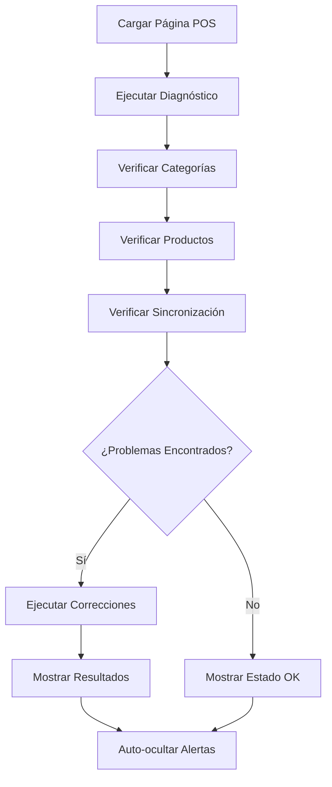

# Sistema POS - Documentación Técnica

## Descripción General

El sistema POS (Point of Sale) de Admintermas es un sistema integral de punto de venta diseñado para hoteles, que incluye dos tipos principales de caja:

- **POS Recepción** (`cashRegisterTypeId: 1`) - Servicios de hotel
- **POS Restaurante** (`cashRegisterTypeId: 2`) - Servicios de restaurante/bar

## Arquitectura del Sistema

### Estructura de Base de Datos

#### Tablas Principales

```sql
-- Categorías POS
POSProductCategory {
    id: number
    name: string
    displayName: string
    cashRegisterTypeId: number (1=Recepción, 2=Restaurante)
    isActive: boolean
    sortOrder: number
    icon: string
    color: string
}

-- Productos POS
POSProduct {
    id: number
    categoryId: number (FK -> POSProductCategory)
    productId: number (FK -> Product)
    name: string
    price: number
    isActive: boolean
    sortOrder: number
}

-- Productos generales
Product {
    id: number
    name: string
    price: number
    isPOSEnabled: boolean
    // ... otros campos
}
```

#### Relaciones Clave

- Un producto debe estar en `Product` con `isPOSEnabled: true`
- El mismo producto debe tener entrada en `POSProduct` con `isActive: true`
- La categoría debe estar activa y tener el `cashRegisterTypeId` correcto

## Sistema de Diagnóstico y Corrección Automática

### Función Principal: `diagnosePOSIssues()`

```typescript
async function diagnosePOSIssues(registerTypeId: number): Promise<string[]>
```

**Propósito**: Diagnostica problemas comunes en el sistema POS

**Verificaciones**:
1. ✅ Categorías disponibles para el tipo de caja
2. ✅ Estado activo/inactivo de categorías
3. ✅ Productos POS disponibles
4. ✅ Sincronización entre `Product` y `POSProduct`
5. ✅ Productos habilitados vs sincronizados
6. ✅ Verificación específica de categoría "Menu Dia"

**Salida**: Array de mensajes de diagnóstico con emojis para fácil identificación

### Función de Corrección: `fixMenuDiaIssue()`

```typescript
async function fixMenuDiaIssue(registerTypeId: number): Promise<string[]>
```

**Propósito**: Corrige problemas específicos con la categoría "Menu Dia"

**Acciones**:
1. 🔍 Busca categorías que contengan "Menu Dia"
2. 🔧 Corrige el `cashRegisterTypeId` si es incorrecto
3. ✅ Activa la categoría si está inactiva
4. ➕ Crea la categoría si no existe

### Función de Productos: `createSampleMenuDiaProducts()`

```typescript
async function createSampleMenuDiaProducts(): Promise<string[]>
```

**Propósito**: Crea productos de prueba para la categoría "Menu Dia"

**Productos Creados**:
- 🍽️ Menú Ejecutivo - $15,000
- 🥗 Menú Vegetariano - $12,000
- 👶 Menú Infantil - $8,000

### Función de Sincronización: `syncPOSProducts()`

```typescript
async function syncPOSProducts(): Promise<string[]>
```

**Propósito**: Sincroniza productos habilitados entre `Product` y `POSProduct`

**Proceso**:
1. 🔍 Busca productos con `isPOSEnabled: true`
2. 📋 Verifica si ya existen en `POSProduct`
3. ➕ Crea entradas faltantes en `POSProduct`
4. 🔄 Actualiza productos existentes

## Integración en la Interfaz de Usuario

### Componente: `ReceptionPOS.tsx`

#### Características Principales

1. **Ejecución Automática**:
   ```typescript
   useEffect(() => {
     runDiagnostic();
   }, []);
   ```

2. **Alertas Visuales**:
   - 🟢 Mensajes de éxito
   - 🟡 Mensajes de advertencia
   - 🔴 Mensajes de error
   - ⚪ Auto-ocultar después de 10 segundos

3. **Logging Detallado**:
   ```typescript
   console.log('🔍 DIAGNÓSTICO POS - Iniciando análisis...');
   ```

### Flujo de Diagnóstico Automático



## Configuración y Uso

### Tipos de Caja Registradora

| Tipo | ID | Descripción | Icono |
|------|----|-----------|----- |
| Recepción | 1 | Servicios de hotel | 🏨 |
| Restaurante | 2 | Servicios de restaurante/bar | 🍽️ |

### Categorías Estándar (Recepción)

1. **Servicio a Habitación** - Productos básicos de hotel
2. **Menu Dia** - Menús del día
3. **Cena** - Servicios de cena
4. **Masajes** - Servicios de spa
5. **Servicios** - Servicios generales
6. **Productos** - Productos de venta
7. **Tours** - Servicios turísticos
8. **Extras** - Servicios adicionales

## Resolución de Problemas Comunes

### Problema: No aparecen productos en POS

**Causa**: Productos no sincronizados entre `Product` y `POSProduct`

**Solución Automática**:
```typescript
await syncPOSProducts();
```

### Problema: Categoría "Menu Dia" no aparece

**Causa**: Categoría con `cashRegisterTypeId` incorrecto

**Solución Automática**:
```typescript
await fixMenuDiaIssue(registerTypeId);
```

### Problema: Categorías inactivas

**Causa**: Categorías con `isActive: false`

**Solución**: El sistema diagnostica y reporta, corrección manual necesaria

## Logs y Monitoreo

### Formato de Logs

```typescript
// Formato estándar
🔍 DIAGNÓSTICO POS - [Acción]
📋 [Descripción]: [Datos]
✅ [Estado exitoso]
⚠️ [Advertencia]
❌ [Error]
```

### Ejemplos de Logs

```
🔍 DIAGNÓSTICO POS - Iniciando análisis...
📋 Verificando categorías POS para registerTypeId: 1
📊 Categorías encontradas: 8
✅ Categorías activas: 8
📦 Productos POS encontrados: 0
🔄 Iniciando sincronización de productos POS...
```

## Seguridad y Validaciones

### Validaciones Implementadas

1. **Tipo de Caja**: Validación de `cashRegisterTypeId` (1 o 2)
2. **Categorías**: Verificación de existencia y estado activo
3. **Productos**: Validación de precio y estado habilitado
4. **Sincronización**: Verificación de integridad de datos

### Manejo de Errores

```typescript
try {
  // Operación POS
} catch (error) {
  console.error('❌ Error en operación POS:', error);
  return [`❌ Error: ${error.message}`];
}
```

## Rendimiento y Optimización

### Consultas Optimizadas

- Uso de `select()` específico para campos necesarios
- Filtros a nivel de base de datos
- Joins eficientes entre tablas relacionadas

### Caching

- Resultados de diagnóstico temporales
- Estado de categorías en memoria
- Productos frecuentemente accedidos

## Futuras Mejoras

### Funcionalidades Planificadas

1. **Dashboard de Monitoreo**: Panel de control para ver estado del sistema
2. **Reportes Automáticos**: Generación de reportes de diagnóstico
3. **Notificaciones**: Alertas automáticas para problemas críticos
4. **Backup Automático**: Respaldo de configuraciones POS

### Optimizaciones Técnicas

1. **Caching Avanzado**: Implementar Redis para mejor rendimiento
2. **Lazy Loading**: Carga diferida de productos y categorías
3. **Indexación**: Optimización de consultas de base de datos
4. **Monitoreo Real-time**: Seguimiento en tiempo real del sistema

## Conclusión

El sistema POS de Admintermas incluye un robusto sistema de diagnóstico y corrección automática que garantiza la operación continua del punto de venta. La implementación incluye validaciones exhaustivas, correcciones automáticas y feedback visual para el usuario.

La arquitectura modular permite fácil extensión y mantenimiento, mientras que el sistema de logs proporciona visibilidad completa de todas las operaciones.

---

**Última actualización**: Enero 2025
**Versión**: 1.0.0
**Autor**: Sistema de Desarrollo Admintermas 