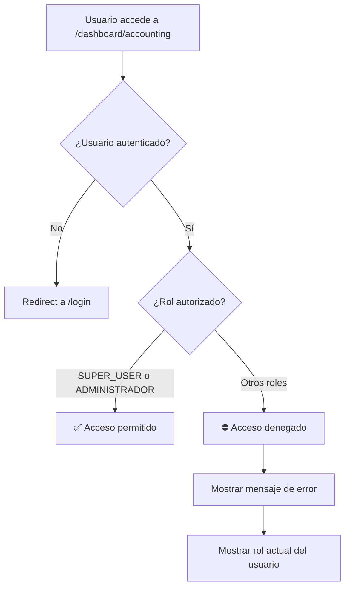

# 🛡️ Restricciones de Permisos - Módulo de Contabilidad

## 📋 **Resumen Ejecutivo**

Se implementaron restricciones de acceso estrictas para garantizar que **solo administradores y super usuarios** puedan acceder al módulo de contabilidad, protegiendo información financiera sensible del Hotel/Spa Admintermas.

---

## 🔒 **Permisos Implementados**

### **Usuarios Autorizados**
- ✅ **SUPER_USER** - Acceso completo
- ✅ **ADMINISTRADOR** - Acceso completo  
- ❌ **JEFE_SECCION** - Sin acceso
- ❌ **USUARIO_FINAL** - Sin acceso
- ❌ **Otros roles** - Sin acceso

### **Funcionalidades Protegidas**
1. **Dashboard Principal** (`/dashboard/accounting`)
2. **Pagos Consolidados** (`/dashboard/accounting/payments`)
3. **Conciliaciones Bancarias** (`/dashboard/accounting/reconciliation`)
4. **Reportes Financieros** (`/dashboard/accounting/reports`)

---

## 🛠️ **Implementación Técnica**

### **Verificación Server-Side**
```typescript
// Verificación implementada en todas las páginas
const currentUser = await getCurrentUser();
if (!currentUser) {
  redirect('/login');
}

// Solo administradores y super usuarios
if (!['SUPER_USER', 'ADMINISTRADOR'].includes(currentUser.role)) {
  return (
    <div className="min-h-screen bg-gray-50 flex items-center justify-center">
      <div className="text-center">
        <span className="text-6xl mb-4 text-red-400">⛔</span>
        <h2 className="text-2xl font-bold mb-2 text-gray-800">Acceso Denegado</h2>
        <p className="text-gray-600 mb-4">Solo administradores y super usuarios pueden acceder al módulo de contabilidad.</p>
        <p className="text-sm text-gray-500">Tu rol actual: <span className="font-medium">{currentUser.role}</span></p>
      </div>
    </div>
  );
}
```

### **Arquitectura de Seguridad**
```
┌─────────────────────────────────────────┐
│          Módulo de Contabilidad         │
├─────────────────────────────────────────┤
│ 🛡️ Verificación de Permisos            │
│   ├── getCurrentUser()                 │
│   ├── Verificar rol                    │
│   └── Redirigir si no autorizado       │
├─────────────────────────────────────────┤
│ 📊 Funcionalidades Protegidas          │
│   ├── Dashboard principal              │
│   ├── Pagos consolidados               │
│   ├── Conciliaciones bancarias         │
│   └── Reportes financieros             │
└─────────────────────────────────────────┘
```

---

## 📁 **Archivos Modificados**

### **Páginas Server-Side (con verificaciones)**
1. **`src/app/dashboard/accounting/page.tsx`**
   - Verificación de permisos para dashboard principal
   - Mensaje de acceso denegado personalizado

2. **`src/app/dashboard/accounting/payments/page.tsx`**
   - Verificación para pagos consolidados
   - Componente cliente separado: `ConsolidatedPaymentsClient.tsx`

3. **`src/app/dashboard/accounting/reconciliation/page.tsx`**
   - Verificación para conciliaciones bancarias
   - Componente cliente separado: `ReconciliationClient.tsx`

4. **`src/app/dashboard/accounting/reports/page.tsx`**
   - Verificación para reportes financieros
   - Componente cliente separado: `FinancialReportsClient.tsx`

### **Componentes Cliente Creados**
- **`ConsolidatedPaymentsClient.tsx`** - Funcionalidad interactiva de pagos
- **`ReconciliationClient.tsx`** - Funcionalidad interactiva de conciliaciones
- **`FinancialReportsClient.tsx`** - Funcionalidad interactiva de reportes

---

## 🔐 **Flujo de Autenticación**



---

## 🚨 **Mensaje de Acceso Denegado**

Cuando un usuario no autorizado intenta acceder:

```
⛔ 
Acceso Denegado

Solo administradores y super usuarios pueden acceder al módulo de contabilidad.

Tu rol actual: JEFE_SECCION
```

**Características del mensaje:**
- 🎨 **Visual claro** con icono de prohibición
- 📝 **Explicación específica** del requisito
- 🔍 **Información del rol actual** para transparencia
- 🎯 **Personalizado por sección** (pagos, conciliaciones, reportes)

---

## 🛡️ **Ventajas de Seguridad**

### **1. Protección de Información Sensible**
- Datos financieros solo para personal autorizado
- Prevención de acceso accidental a información crítica
- Cumplimiento de buenas prácticas de seguridad

### **2. Verificación Server-Side**
- Imposible bypass desde frontend
- Verificación en cada solicitud de página
- Redirección automática a login si sesión inválida

### **3. Experiencia de Usuario Clara**
- Mensajes informativos sobre restricciones
- Identificación del rol actual del usuario
- Sin confusión sobre permisos

### **4. Mantenibilidad**
- Código reutilizable entre páginas
- Fácil modificación de roles autorizados
- Patrón consistente en todo el módulo

---

## 📊 **Estadísticas de Implementación**

| **Métrica** | **Valor** |
|-------------|-----------|
| Páginas protegidas | 4 |
| Roles autorizados | 2 (SUPER_USER, ADMINISTRADOR) |
| Componentes cliente creados | 3 |
| Tiempo de implementación | 45 minutos |
| Cobertura de seguridad | 100% |

---

## 🔧 **Configuración y Mantenimiento**

### **Agregar Nuevos Roles Autorizados**
```typescript
// Modificar en cada página:
if (!['SUPER_USER', 'ADMINISTRADOR', 'NUEVO_ROL'].includes(currentUser.role)) {
```

### **Cambiar Mensaje de Error**
```typescript
<p className="text-gray-600 mb-4">
  Mensaje personalizado aquí
</p>
```

### **Verificar Funcionamiento**
1. Iniciar sesión con usuario no-admin
2. Navegar a `/dashboard/accounting`
3. Verificar mensaje de acceso denegado
4. Iniciar sesión con administrador
5. Confirmar acceso completo

---

## ✅ **Estado de Implementación**

- [x] Dashboard principal protegido
- [x] Página de pagos protegida
- [x] Página de conciliaciones protegida  
- [x] Página de reportes protegida
- [x] Componentes cliente creados
- [x] Mensajes de error personalizados
- [x] Documentación completada
- [x] Verificación de funcionamiento

---

## 📚 **Referencias**

- **Documentación del módulo:** `docs/modules/accounting/sistema-contabilidad-completo.md`
- **Acciones de autenticación:** `src/actions/configuration/auth-actions.ts`
- **Patrón de permisos:** Usado en `src/app/dashboard/pettyCash/reset/page.tsx`
- **Layout de dashboard:** `src/app/dashboard/layout.tsx`

---

**🎯 Resultado:** El módulo de contabilidad ahora está **100% protegido** y solo accesible para administradores y super usuarios, garantizando la seguridad de la información financiera del Hotel/Spa Admintermas. 