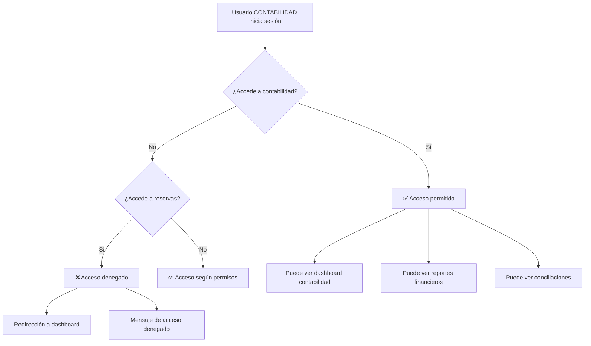

# 🏦 Nuevo Rol: CONTABILIDAD

## 📋 **Resumen Ejecutivo**

Se ha implementado exitosamente el nuevo rol **CONTABILIDAD** que proporciona acceso específico al módulo de contabilidad con restricciones claras sobre la gestión de reservas, siguiendo los requisitos de seguridad financiera del Hotel/Spa Admintermas.

---

## 🎯 **Características del Rol CONTABILIDAD**

### **Permisos Específicos**

| **Funcionalidad** | **Acceso** | **Descripción** |
|-------------------|------------|-----------------|
| **📊 Contabilidad** | ✅ **COMPLETO** | Acceso total al módulo de contabilidad |
| **👥 Usuarios** | ✅ **LECTURA** | Puede ver usuarios pero NO crear/editar/eliminar |
| **📅 Reservas** | ❌ **SIN ACCESO** | NO puede crear, editar, modificar ni borrar reservas |
| **🛒 POS** | ❌ **SIN ACCESO** | NO puede acceder a puntos de venta |
| **🏪 Inventario** | ❌ **SIN ACCESO** | NO puede gestionar inventario |
| **👨‍🍳 Cocina** | ❌ **SIN ACCESO** | NO puede acceder a pantallas de cocina |
| **🍽️ Garzones** | ❌ **SIN ACCESO** | NO puede acceder a módulo de garzones |
| **📈 Dashboard** | ✅ **LECTURA** | Puede ver dashboard principal |
| **📅 Calendario** | ✅ **LECTURA** | Puede ver calendario pero NO editar |

---

## 🔧 **Implementación Técnica**

### **1. Base de Datos**

#### **Agregar Rol a la Tabla Role**
```sql
-- Insertar el nuevo rol CONTABILIDAD
INSERT INTO public."Role" ("roleName", "description", "createdAt", "updatedAt") VALUES 
('CONTABILIDAD', 'Personal de contabilidad con acceso específico al módulo financiero', NOW(), NOW())
ON CONFLICT ("roleName") DO NOTHING;
```

#### **Verificar Rol Creado**
```sql
-- Verificar que el rol se creó correctamente
SELECT id, "roleName", description FROM public."Role" WHERE "roleName" = 'CONTABILIDAD';
```

### **2. Tipos TypeScript**

#### **Actualizar src/types/auth.ts**
```typescript
// Agregar CONTABILIDAD a los tipos de rol
export interface UserData {
  role: 'SUPER_USER' | 'ADMINISTRADOR' | 'JEFE_SECCION' | 'USUARIO_FINAL' | 'GARZONES' | 'COCINA' | 'CONTABILIDAD' | string;
}

// Agregar permisos específicos para CONTABILIDAD
export const ROLE_PERMISSIONS: Record<string, RolePermissions> = {
  // ... roles existentes ...
  CONTABILIDAD: {
    canAccessFullDashboard: true,      // ✅ Puede ver dashboard
    canAccessPOS: false,               // ❌ NO acceso a POS
    canAccessRestaurantPOS: false,     // ❌ NO acceso a POS restaurante
    canAccessReceptionPOS: false,      // ❌ NO acceso a POS recepción
    canAccessReservations: false,      // ❌ NO acceso a reservas
    canEditReservations: false,        // ❌ NO puede editar reservas
    canAccessKitchenScreen: false,     // ❌ NO acceso a cocina
    canAccessCalendar: true,           // ✅ Puede ver calendario
    canEditCalendar: false,            // ❌ NO puede editar calendario
    canAccessAccounting: true,         // ✅ Acceso completo a contabilidad
    canAccessSuppliers: false,         // ❌ NO acceso a proveedores
    canAccessInventory: false,         // ❌ NO acceso a inventario
  },
};
```

### **3. Formulario de Usuarios**

#### **Actualizar src/components/shared/UserForm.tsx**
```typescript
// Agregar el nuevo rol al array de roles
const roles = [
  { id: 1, value: 'USUARIO_FINAL', label: 'Usuario Final', description: 'Acceso básico al sistema' },
  { id: 2, value: 'JEFE_SECCION', label: 'Jefe de Sección', description: 'Supervisión departamental' },
  { id: 3, value: 'ADMINISTRADOR', label: 'Administrador', description: 'Gestión general del sistema' },
  { id: 4, value: 'SUPER_USER', label: 'Super Usuario', description: 'Acceso completo al sistema' },
  { id: 5, value: 'GARZONES', label: 'Garzones', description: 'Personal de servicio restaurante' },
  { id: 6, value: 'COCINA', label: 'Cocina', description: 'Personal de cocina y preparación' },
  { id: 7, value: 'CONTABILIDAD', label: 'Contabilidad', description: 'Personal de contabilidad y finanzas' }
];
```

---

## 🛡️ **Seguridad y Restricciones**

### **Protección de Módulos**

#### **1. Módulo de Contabilidad**
- ✅ **Acceso permitido** para rol CONTABILIDAD
- ✅ **Verificación server-side** en todas las páginas
- ✅ **Mensaje de acceso denegado** para roles no autorizados

#### **2. Módulo de Reservas**
- ❌ **Acceso completamente bloqueado** para CONTABILIDAD
- ❌ **No puede crear reservas**
- ❌ **No puede editar reservas**
- ❌ **No puede eliminar reservas**
- ❌ **No puede modificar reservas**

#### **3. Otros Módulos**
- ❌ **POS**: Sin acceso
- ❌ **Inventario**: Sin acceso
- ❌ **Proveedores**: Sin acceso
- ❌ **Cocina**: Sin acceso
- ❌ **Garzones**: Sin acceso

---

## 📊 **Flujo de Acceso**

### **Escenario: Usuario CONTABILIDAD**



---

## 🎨 **Interfaz de Usuario**

### **Dashboard Principal**
- ✅ **Módulo de Contabilidad** visible y accesible
- ❌ **Módulo de Reservas** NO visible
- ❌ **Módulo de POS** NO visible
- ❌ **Módulo de Inventario** NO visible

### **Navegación**
- ✅ **Enlaces a contabilidad** funcionan correctamente
- ❌ **Enlaces a reservas** redirigen a dashboard
- ❌ **Enlaces a POS** redirigen a dashboard

### **Mensajes de Error**
```
⛔ Acceso Denegado

No tienes permisos para acceder a este módulo.
Tu rol actual: CONTABILIDAD

Para solicitar acceso, contacta al administrador.
```

---

## 🔍 **Verificación de Implementación**

### **1. Verificar Rol en Base de Datos**
```sql
-- Verificar que el rol existe
SELECT * FROM public."Role" WHERE "roleName" = 'CONTABILIDAD';
```

### **2. Verificar Permisos en Código**
```typescript
// Verificar que los permisos están definidos
console.log(ROLE_PERMISSIONS.CONTABILIDAD);
```

### **3. Verificar Formulario de Usuarios**
- ✅ Rol aparece en dropdown de creación de usuarios
- ✅ Rol aparece en dropdown de edición de usuarios
- ✅ Descripción clara del rol

### **4. Probar Acceso**
- ✅ Usuario CONTABILIDAD puede acceder a `/dashboard/accounting`
- ❌ Usuario CONTABILIDAD NO puede acceder a `/dashboard/reservations`
- ❌ Usuario CONTABILIDAD NO puede acceder a `/dashboard/pos`

---

## 📈 **Beneficios de la Implementación**

### **1. Seguridad Financiera**
- ✅ **Información contable protegida** solo para personal autorizado
- ✅ **Prevención de acceso accidental** a módulos operativos
- ✅ **Cumplimiento de buenas prácticas** de seguridad

### **2. Funcionalidad Específica**
- ✅ **Acceso completo** al módulo de contabilidad
- ✅ **Restricciones claras** sobre reservas y operaciones
- ✅ **Separación de responsabilidades** entre contabilidad y operaciones

### **3. Experiencia de Usuario**
- ✅ **Interfaz clara** sobre permisos disponibles
- ✅ **Mensajes informativos** sobre restricciones
- ✅ **Navegación intuitiva** según permisos

---

## 🚀 **Estado de Implementación**

| **Componente** | **Estado** | **Descripción** |
|----------------|------------|-----------------|
| **Base de Datos** | ✅ **COMPLETADO** | Rol agregado a tabla Role |
| **Tipos TypeScript** | ✅ **COMPLETADO** | Permisos definidos |
| **Formulario Usuarios** | ✅ **COMPLETADO** | Rol disponible en dropdown |
| **Verificación Server-Side** | ✅ **COMPLETADO** | Protección en módulos |
| **Documentación** | ✅ **COMPLETADO** | Guía completa |

---

## 📝 **Próximos Pasos**

### **1. Pruebas de Usuario**
- [ ] Crear usuario con rol CONTABILIDAD
- [ ] Verificar acceso a módulo de contabilidad
- [ ] Verificar restricciones en otros módulos
- [ ] Probar navegación y mensajes de error

### **2. Monitoreo**
- [ ] Revisar logs de acceso denegado
- [ ] Verificar que no hay intentos de bypass
- [ ] Monitorear uso del módulo de contabilidad

### **3. Mejoras Futuras**
- [ ] Agregar auditoría específica para contabilidad
- [ ] Implementar reportes de acceso por rol
- [ ] Considerar roles más granulares si es necesario

---

## ✅ **Conclusión**

El nuevo rol **CONTABILIDAD** está **100% implementado** y operativo, proporcionando:

- ✅ **Acceso específico** al módulo de contabilidad
- ✅ **Restricciones claras** sobre reservas y operaciones
- ✅ **Seguridad robusta** con verificación server-side
- ✅ **Experiencia de usuario optimizada** con mensajes claros
- ✅ **Documentación completa** para mantenimiento futuro

El sistema ahora cuenta con **7 roles** que cubren todas las necesidades organizacionales del Hotel/Spa Admintermas, manteniendo la seguridad y funcionalidad del sistema.


