# 🛠️ Guía Técnica de Implementación - Módulo de Emails

## 📋 Índice

1. [Arquitectura del Sistema](#arquitectura-del-sistema)
2. [Base de Datos](#base-de-datos)
3. [Backend (Server Actions)](#backend-server-actions)
4. [Frontend (Componentes)](#frontend-componentes)
5. [APIs REST](#apis-rest)
6. [Integración con IA](#integración-con-ia)
7. [Configuración](#configuración)
8. [Testing](#testing)
9. [Deployment](#deployment)

---

## 🏗️ Arquitectura del Sistema

### **Diagrama de Flujo**

```mermaid
flowchart TD
    A[📧 Gmail API] --> B[Email Analysis Service]
    B --> C[ChatGPT Analysis]
    C --> D[Client Identification]
    D --> E[Database Storage]
    
    F[📤 Email Sending] --> G[Tracking Service]
    G --> E
    
    E --> H[Dashboard Updates]
    E --> I[Real-time Stats]
    E --> J[Welcome Modal]
    
    K[Scheduler] --> B
    L[Manual Triggers] --> B
```


### **Stack Tecnológico**
- **Frontend:** Next.js 15.3.3 + TypeScript + Tailwind CSS
- **Backend:** Next.js Server Actions + Supabase
- **Base de Datos:** PostgreSQL (Supabase)
- **IA:** OpenAI GPT-4
- **Email:** Gmail API
- **UI Components:** Radix UI + Lucide Icons

---

## 🗄️ Base de Datos

### **1. Tabla: EmailAnalysisReports**
```sql
CREATE TABLE EmailAnalysisReports (
  id BIGSERIAL PRIMARY KEY,
  analysis_date DATE NOT NULL DEFAULT CURRENT_DATE,
  total_emails INTEGER NOT NULL DEFAULT 0,
  processed_emails INTEGER NOT NULL DEFAULT 0,
  summary TEXT,
  details JSONB,
  metadata JSONB,
  created_at TIMESTAMPTZ DEFAULT NOW(),
  updated_at TIMESTAMPTZ DEFAULT NOW()
);
```

**Propósito:** Almacenar reportes diarios de análisis de correos con ChatGPT.

### **2. Tabla: EmailClientAssociation**
```sql
CREATE TABLE EmailClientAssociation (
  id BIGSERIAL PRIMARY KEY,
  email_address VARCHAR(255) NOT NULL,
  client_id BIGINT REFERENCES Client(id),
  sender_name VARCHAR(255),
  email_subject TEXT,
  email_body TEXT,
  analysis_result JSONB,
  payment_info JSONB,
  associated_at TIMESTAMPTZ DEFAULT NOW(),
  confidence_score DECIMAL(3,2)
);
```

**Propósito:** Asociar correos recibidos con clientes registrados.

### **3. Tabla: SentEmailTracking**
```sql
CREATE TABLE SentEmailTracking (
  id BIGSERIAL PRIMARY KEY,
  recipient_email VARCHAR(255) NOT NULL,
  subject VARCHAR(500) NOT NULL,
  body_content TEXT,
  email_type VARCHAR(50) NOT NULL, -- confirmation, reminder, etc.
  status VARCHAR(50) DEFAULT 'sent', -- sent, delivered, opened, etc.
  client_id BIGINT REFERENCES Client(id),
  reservation_id BIGINT REFERENCES reservations(id),
  budget_id BIGINT REFERENCES sales_quotes(id),
  sent_by_user_id UUID REFERENCES UserProfile(id),
  sent_at TIMESTAMPTZ DEFAULT NOW(),
  delivered_at TIMESTAMPTZ,
  opened_at TIMESTAMPTZ,
  metadata JSONB
);
```

**Propósito:** Tracking completo de correos enviados.

### **4. Tabla: ClientCommunicationSummary**
```sql
CREATE TABLE ClientCommunicationSummary (
  id BIGSERIAL PRIMARY KEY,
  client_id BIGINT REFERENCES Client(id) UNIQUE,
  total_emails_received INTEGER DEFAULT 0,
  total_emails_sent INTEGER DEFAULT 0,
  last_email_received TIMESTAMPTZ,
  last_email_sent TIMESTAMPTZ,
  communication_score INTEGER DEFAULT 0,
  updated_at TIMESTAMPTZ DEFAULT NOW()
);
```

**Propósito:** Resumen de comunicaciones por cliente.

### **Funciones SQL Implementadas**

#### **find_client_by_email()**
```sql
CREATE OR REPLACE FUNCTION find_client_by_email(email_address TEXT)
RETURNS TABLE(
  client_id BIGINT,
  nombre_principal VARCHAR,
  apellido VARCHAR,
  telefono VARCHAR,
  email VARCHAR,
  total_reservations BIGINT
) AS $$
BEGIN
  RETURN QUERY
  SELECT 
    c.id,
    c."nombrePrincipal",
    c.apellido,
    c.telefono,
    c.email,
    COUNT(r.id) as total_reservations
  FROM Client c
  LEFT JOIN reservations r ON c.id = r.client_id
  WHERE LOWER(c.email) = LOWER(email_address)
  GROUP BY c.id, c."nombrePrincipal", c.apellido, c.telefono, c.email;
END;
$$ LANGUAGE plpgsql;
```

#### **get_client_recent_reservations()**
```sql
CREATE OR REPLACE FUNCTION get_client_recent_reservations(client_id_param BIGINT)
RETURNS TABLE(
  reservation_id BIGINT,
  check_in DATE,
  check_out DATE,
  total_amount DECIMAL,
  status VARCHAR,
  created_at TIMESTAMPTZ
) AS $$
BEGIN
  RETURN QUERY
  SELECT 
    r.id,
    r.check_in,
    r.check_out,
    r.total_amount,
    r.status,
    r.created_at
  FROM reservations r
  WHERE r.client_id = client_id_param
  ORDER BY r.created_at DESC
  LIMIT 5;
END;
$$ LANGUAGE plpgsql;
```

---

## ⚙️ Backend (Server Actions)

### **1. analysis-actions.ts**

#### **analyzeEmailsWithAI()**
```typescript
'use server'

import { openai } from '@/lib/openai'
import { getSupabaseServerClient } from '@/lib/supabase-server'

export async function analyzeEmailsWithAI() {
  try {
    const supabase = await getSupabaseServerClient()
    
    // Obtener correos no leídos
    const emails = await getUnreadEmails()
    
    if (emails.length === 0) {
      return { 
        success: true, 
        message: "✅ Excelente! No hay correos sin leer",
        data: { totalEmails: 0, processedEmails: 0 }
      }
    }

    // Prompt optimizado para ChatGPT
    const prompt = `
    Como experto en atención al cliente de Hotel Termas Llifén, analiza los siguientes correos recibidos hoy:

    ${emails.map((email, i) => `
    CORREO ${i + 1}:
    De: ${email.from}
    Asunto: ${email.subject}
    Contenido: ${email.body}
    ---
    `).join('\n')}

    Por favor proporciona:
    1. RESUMEN EJECUTIVO (máximo 2 líneas)
    2. CORREOS IMPORTANTES (identifica urgencias, pagos, quejas)
    3. ACCIONES RECOMENDADAS
    4. CLIENTES IDENTIFICADOS (nombres y emails)
    `

    const completion = await openai.chat.completions.create({
      model: "gpt-4",
      messages: [{ role: "user", content: prompt }],
      max_tokens: 1000,
      temperature: 0.3
    })

    const analysis = completion.choices[0]?.message?.content || 'Análisis no disponible'

    // Guardar en base de datos
    const { data, error } = await supabase
      .from('EmailAnalysisReports')
      .insert({
        total_emails: emails.length,
        processed_emails: emails.length,
        summary: analysis.substring(0, 500),
        details: { full_analysis: analysis, emails_analyzed: emails.length },
        metadata: { model: "gpt-4", timestamp: new Date().toISOString() }
      })
      .select()
      .single()

    if (error) throw error

    return {
      success: true,
      data: {
        totalEmails: emails.length,
        processedEmails: emails.length,
        analysis,
        report: data
      }
    }

  } catch (error) {
    console.error('❌ Error analyzing emails:', error)
    return {
      success: false,
      error: error instanceof Error ? error.message : 'Error desconocido'
    }
  }
}
```

### **2. client-analysis-actions.ts**

#### **findClientByEmail()**
```typescript
'use server'

import { getSupabaseServerClient } from '@/lib/supabase-server'

export async function findClientByEmail(email: string) {
  try {
    const supabase = await getSupabaseServerClient()
    
    const { data, error } = await supabase
      .rpc('find_client_by_email', { email_address: email })
    
    if (error) throw error
    
    if (data && data.length > 0) {
      const client = data[0]
      
      // Obtener reservas recientes
      const { data: reservations } = await supabase
        .rpc('get_client_recent_reservations', { client_id_param: client.client_id })
      
      return {
        success: true,
        data: {
          client: {
            id: client.client_id,
            nombrePrincipal: client.nombre_principal,
            apellido: client.apellido,
            telefono: client.telefono,
            email: client.email,
            totalReservations: Number(client.total_reservations)
          },
          reservations: reservations || []
        }
      }
    }
    
    return {
      success: true,
      data: null,
      message: 'Cliente no encontrado'
    }
    
  } catch (error) {
    console.error('❌ Error finding client:', error)
    return {
      success: false,
      error: error instanceof Error ? error.message : 'Error al buscar cliente'
    }
  }
}
```

### **3. sent-email-actions.ts**

#### **trackSentEmail()**
```typescript
'use server'

export async function trackSentEmail(emailData: SentEmailData) {
  try {
    const supabase = await getSupabaseServerClient()
    const currentUser = await getCurrentUser()
    
    const { data, error } = await supabase
      .from('SentEmailTracking')
      .insert({
        recipient_email: emailData.recipientEmail,
        subject: emailData.subject,
        body_content: emailData.bodyContent,
        email_type: emailData.emailType,
        status: 'sent',
        client_id: emailData.clientId || null,
        reservation_id: emailData.reservationId || null,
        budget_id: emailData.budgetId || null,
        sent_by_user_id: currentUser?.id || null,
        metadata: emailData.metadata || {}
      })
      .select()
      .single()
    
    if (error) throw error
    
    // Trigger para actualizar resumen de comunicación
    if (emailData.clientId) {
      await supabase
        .rpc('update_client_communication_summary', { 
          client_id_param: emailData.clientId,
          increment_sent: true 
        })
    }
    
    return {
      success: true,
      data,
      message: 'Email registrado correctamente'
    }
    
  } catch (error) {
    console.error('❌ Error tracking email:', error)
    return {
      success: false,
      error: error instanceof Error ? error.message : 'Error al registrar email'
    }
  }
}
```

---

## 🎨 Frontend (Componentes)

### **1. EmailDashboard.tsx**

#### **Estructura Principal**
```typescript
'use client'

import { useState, useEffect } from 'react'
import { Card, CardContent, CardHeader, CardTitle } from '@/components/ui/card'
import { Badge } from '@/components/ui/badge'
import { analyzeEmailsWithAI, getEmailAnalysisReports } from '@/actions/emails/analysis-actions'

export default function EmailDashboard() {
  const [reports, setReports] = useState<EmailAnalysisReport[]>([])
  const [loading, setLoading] = useState(true)
  const [analyzing, setAnalyzing] = useState(false)

  useEffect(() => {
    loadReports()
  }, [])

  const loadReports = async () => {
    setLoading(true)
    try {
      const result = await getEmailAnalysisReports()
      if (result.success) {
        setReports(result.data || [])
      }
    } catch (error) {
      console.error('Error loading reports:', error)
    } finally {
      setLoading(false)
    }
  }

  const handleAnalyzeNow = async () => {
    setAnalyzing(true)
    try {
      const result = await analyzeEmailsWithAI()
      if (result.success) {
        toast.success(`Análisis completado: ${result.data?.processedEmails} correos procesados`)
        await loadReports()
      } else {
        toast.error(result.error || 'Error en el análisis')
      }
    } catch (error) {
      toast.error('Error inesperado')
    } finally {
      setAnalyzing(false)
    }
  }

  return (
    <div className="space-y-6">
      {/* Header con estadísticas */}
      <div className="grid grid-cols-1 md:grid-cols-3 gap-6">
        <Card>
          <CardHeader className="flex flex-row items-center justify-between space-y-0 pb-2">
            <CardTitle className="text-sm font-medium">Correos Analizados Hoy</CardTitle>
            <MailIcon className="h-4 w-4 text-muted-foreground" />
          </CardHeader>
          <CardContent>
            <div className="text-2xl font-bold">{todayStats.totalEmails}</div>
            <p className="text-xs text-muted-foreground">
              {todayStats.processedEmails} procesados
            </p>
          </CardContent>
        </Card>
        
        {/* Más estadísticas... */}
      </div>

      {/* Reportes recientes */}
      <Card>
        <CardHeader>
          <div className="flex items-center justify-between">
            <CardTitle>Análisis de Correos Recientes</CardTitle>
            <Button 
              onClick={handleAnalyzeNow} 
              disabled={analyzing}
              size="sm"
            >
              {analyzing ? (
                <>
                  <Loader2 className="h-4 w-4 mr-2 animate-spin" />
                  Analizando...
                </>
              ) : (
                <>
                  <RefreshCw className="h-4 w-4 mr-2" />
                  Analizar Ahora
                </>
              )}
            </Button>
          </div>
        </CardHeader>
        <CardContent>
          {loading ? (
            <div className="text-center py-8">
              <Loader2 className="h-8 w-8 animate-spin mx-auto mb-4" />
              <p>Cargando reportes...</p>
            </div>
          ) : reports.length === 0 ? (
            <div className="text-center py-8 text-muted-foreground">
              No hay reportes disponibles
            </div>
          ) : (
            <div className="space-y-4">
              {reports.map((report) => (
                <div key={report.id} className="border rounded-lg p-4">
                  <div className="flex items-center justify-between mb-2">
                    <div className="flex items-center gap-2">
                      <Badge variant="outline">
                        {new Date(report.analysis_date).toLocaleDateString('es-CL')}
                      </Badge>
                      <span className="text-sm text-muted-foreground">
                        {report.processed_emails} correos procesados
                      </span>
                    </div>
                  </div>
                  <p className="text-sm">{report.summary}</p>
                </div>
              ))}
            </div>
          )}
        </CardContent>
      </Card>
    </div>
  )
}
```

### **2. EmailAnalysisPopup.tsx**

#### **Modal de Bienvenida**
```typescript
'use client'

export function EmailAnalysisPopup() {
  const [isOpen, setIsOpen] = useState(false)
  const [analysis, setAnalysis] = useState<EmailAnalysis | null>(null)
  const [loading, setLoading] = useState(false)

  useEffect(() => {
    checkForTodayAnalysis()
  }, [])

  const checkForTodayAnalysis = async () => {
    try {
      const result = await getTodayEmailAnalysis()
      if (result.success && result.data) {
        setAnalysis(result.data)
        setIsOpen(true)
      }
    } catch (error) {
      console.error('Error checking analysis:', error)
    }
  }

  return (
    <Dialog open={isOpen} onOpenChange={setIsOpen}>
      <DialogContent className="max-w-2xl">
        <DialogHeader>
          <DialogTitle className="flex items-center gap-2">
            <Mail className="h-5 w-5 text-blue-600" />
            Análisis de Correos - {new Date().toLocaleDateString('es-CL')}
          </DialogTitle>
        </DialogHeader>
        
        <div className="space-y-4">
          {/* Estadísticas rápidas */}
          <div className="grid grid-cols-2 gap-4">
            <div className="bg-blue-50 p-3 rounded-lg">
              <div className="text-2xl font-bold text-blue-600">
                {analysis?.totalEmails || 0}
              </div>
              <div className="text-sm text-blue-700">Correos no leídos</div>
            </div>
            <div className="bg-green-50 p-3 rounded-lg">
              <div className="text-2xl font-bold text-green-600">
                {analysis?.clientsIdentified || 0}
              </div>
              <div className="text-sm text-green-700">Clientes identificados</div>
            </div>
          </div>

          {/* Resumen del análisis */}
          {analysis?.summary && (
            <div className="bg-gray-50 p-4 rounded-lg">
              <h4 className="font-medium mb-2">Resumen del Análisis</h4>
              <p className="text-sm text-gray-600">{analysis.summary}</p>
            </div>
          )}

          {/* Acciones rápidas */}
          <div className="flex gap-2">
            <Button 
              size="sm" 
              onClick={() => window.location.href = '/dashboard/emails'}
            >
              Ver Dashboard Completo
            </Button>
            <Button 
              variant="outline" 
              size="sm"
              onClick={() => setIsOpen(false)}
            >
              Cerrar
            </Button>
          </div>
        </div>
      </DialogContent>
    </Dialog>
  )
}
```

---

## 🌐 APIs REST

### **1. /api/emails/analysis-scheduler/route.ts**

#### **Scheduler Automático**
```typescript
import { NextResponse } from 'next/server'
import { analyzeEmailsWithAI } from '@/actions/emails/analysis-actions'

export async function POST() {
  try {
    console.log('🕐 Iniciando análisis programado de correos...')
    
    const result = await analyzeEmailsWithAI()
    
    if (result.success) {
      console.log(`✅ Análisis completado: ${result.data?.processedEmails} correos procesados`)
      
      return NextResponse.json({
        success: true,
        message: 'Análisis completado exitosamente',
        data: result.data
      })
    } else {
      console.error('❌ Error en análisis programado:', result.error)
      
      return NextResponse.json({
        success: false,
        error: result.error
      }, { status: 500 })
    }
    
  } catch (error) {
    console.error('❌ Error crítico en scheduler:', error)
    
    return NextResponse.json({
      success: false,
      error: 'Error interno del servidor'
    }, { status: 500 })
  }
}
```

### **2. /api/emails/client-associations/route.ts**

#### **Asociaciones Cliente-Email**
```typescript
export async function GET(request: Request) {
  try {
    const { searchParams } = new URL(request.url)
    const recent = searchParams.get('recent') === 'true'
    const limit = parseInt(searchParams.get('limit') || '10')
    
    const supabase = await getSupabaseServerClient()
    
    let query = supabase
      .from('EmailClientAssociation')
      .select(`
        *,
        Client:client_id (
          id,
          nombrePrincipal,
          apellido,
          email,
          telefono
        )
      `)
      .order('associated_at', { ascending: false })
    
    if (recent) {
      const today = new Date()
      today.setHours(0, 0, 0, 0)
      query = query.gte('associated_at', today.toISOString())
    }
    
    query = query.limit(limit)
    
    const { data, error } = await query
    
    if (error) throw error
    
    return NextResponse.json({
      success: true,
      data: data || []
    })
    
  } catch (error) {
    console.error('❌ Error getting client associations:', error)
    return NextResponse.json({
      success: false,
      error: 'Error al obtener asociaciones'
    }, { status: 500 })
  }
}
```

---

## 🤖 Integración con IA

### **Configuración OpenAI**

#### **lib/openai.ts**
```typescript
import OpenAI from 'openai'

export const openai = new OpenAI({
  apiKey: process.env.OPENAI_API_KEY!,
})

// Prompts optimizados
export const EMAIL_ANALYSIS_PROMPT = `
Como experto en atención al cliente de Hotel Termas Llifén, analiza los correos recibidos.

CONTEXTO DEL HOTEL:
- Hotel & Spa de lujo en Chile
- Servicios: alojamiento, spa, termas, gastronomía
- Clientes principales: turistas nacionales e internacionales

INSTRUCCIONES:
1. Identifica correos importantes (pagos, quejas, consultas urgentes)
2. Detecta confirmaciones de transferencias o pagos
3. Clasifica por urgencia (Alta/Media/Baja)
4. Sugiere acciones específicas
5. Identifica posibles clientes VIP o frecuentes

FORMATO DE RESPUESTA:
- Resumen ejecutivo (máximo 2 líneas)
- Lista de acciones prioritarias
- Clientes identificados con nombres y emails
- Nivel de urgencia general
`

export const CLIENT_IDENTIFICATION_PROMPT = `
Analiza este correo y extrae información del cliente:

INFORMACIÓN A EXTRAER:
- Nombre completo del remitente
- Email de contacto
- Información de pago (monto, método, referencia)
- Tipo de consulta (reserva, pago, queja, información)
- Urgencia del mensaje
- Fechas mencionadas

CORREO A ANALIZAR:
{email_content}

Responde en formato JSON válido.
`
```

### **Funciones de Análisis IA**

#### **utils/ai-analysis.ts**
```typescript
import { openai, EMAIL_ANALYSIS_PROMPT } from '@/lib/openai'

export async function analyzeEmailContent(emails: EmailData[]) {
  try {
    const emailsText = emails.map((email, i) => `
    CORREO ${i + 1}:
    De: ${email.from}
    Asunto: ${email.subject}
    Fecha: ${email.date}
    Contenido: ${email.body}
    ---
    `).join('\n')

    const completion = await openai.chat.completions.create({
      model: "gpt-4",
      messages: [
        {
          role: "system", 
          content: EMAIL_ANALYSIS_PROMPT
        },
        {
          role: "user",
          content: `Analiza estos ${emails.length} correos:\n\n${emailsText}`
        }
      ],
      max_tokens: 1500,
      temperature: 0.3
    })

    return {
      success: true,
      analysis: completion.choices[0]?.message?.content || '',
      usage: completion.usage
    }
    
  } catch (error) {
    console.error('❌ Error in AI analysis:', error)
    return {
      success: false,
      error: error instanceof Error ? error.message : 'Error de IA'
    }
  }
}

export async function identifyClientFromEmail(emailContent: string) {
  try {
    const completion = await openai.chat.completions.create({
      model: "gpt-4",
      messages: [
        {
          role: "system",
          content: CLIENT_IDENTIFICATION_PROMPT.replace('{email_content}', emailContent)
        }
      ],
      max_tokens: 500,
      temperature: 0.1
    })

    const response = completion.choices[0]?.message?.content || '{}'
    return {
      success: true,
      data: JSON.parse(response)
    }
    
  } catch (error) {
    console.error('❌ Error identifying client:', error)
    return {
      success: false,
      error: 'Error al identificar cliente'
    }
  }
}
```

---

## ⚙️ Configuración

### **Variables de Entorno (.env.local)**
```bash
# OpenAI Configuration
OPENAI_API_KEY=sk-...

# Gmail API Configuration  
GMAIL_CLIENT_ID=your_client_id
GMAIL_CLIENT_SECRET=your_client_secret
GMAIL_REFRESH_TOKEN=your_refresh_token

# Supabase Configuration
NEXT_PUBLIC_SUPABASE_URL=your_supabase_url
NEXT_PUBLIC_SUPABASE_ANON_KEY=your_anon_key
SUPABASE_SERVICE_ROLE_KEY=your_service_role_key

# Email Analysis Configuration
EMAIL_ANALYSIS_ENABLED=true
EMAIL_ANALYSIS_FREQUENCY=4  # times per day
MAX_EMAILS_PER_ANALYSIS=50
```

### **Configuración de Tipos TypeScript**

#### **types/email.ts**
```typescript
export interface EmailAnalysisReport {
  id: number
  analysis_date: string
  total_emails: number
  processed_emails: number
  summary: string
  details: {
    full_analysis: string
    emails_analyzed: number
    clients_identified?: number
    urgent_emails?: number
  }
  metadata: {
    model: string
    timestamp: string
    processing_time?: number
  }
  created_at: string
  updated_at: string
}

export interface EmailClientAssociation {
  id: number
  email_address: string
  client_id: number | null
  sender_name: string | null
  email_subject: string | null
  email_body: string | null
  analysis_result: {
    client_info?: any
    confidence_score?: number
    payment_detected?: boolean
    urgency_level?: 'high' | 'medium' | 'low'
  }
  payment_info: {
    amount?: number
    method?: string
    reference?: string
    detected?: boolean
  } | null
  associated_at: string
  confidence_score: number | null
}

export interface SentEmailTracking {
  id: number
  recipient_email: string
  subject: string
  body_content: string | null
  email_type: 'confirmation' | 'reminder' | 'payment_request' | 'follow_up' | 'marketing' | 'custom'
  status: 'sent' | 'delivered' | 'opened' | 'clicked' | 'bounced' | 'failed'
  client_id: number | null
  reservation_id: number | null
  budget_id: number | null
  sent_by_user_id: string | null
  sent_at: string
  delivered_at: string | null
  opened_at: string | null
  metadata: Record<string, any>
}
```

---

## 🧪 Testing

### **Estrategia de Testing**

#### **1. Tests Unitarios (Jest)**
```typescript
// __tests__/email-analysis.test.ts
import { analyzeEmailsWithAI } from '@/actions/emails/analysis-actions'
import { findClientByEmail } from '@/actions/emails/client-analysis-actions'

describe('Email Analysis', () => {
  test('analyzeEmailsWithAI should process emails correctly', async () => {
    const result = await analyzeEmailsWithAI()
    
    expect(result).toHaveProperty('success')
    if (result.success) {
      expect(result.data).toHaveProperty('totalEmails')
      expect(result.data).toHaveProperty('processedEmails')
    }
  })

  test('findClientByEmail should find existing client', async () => {
    const result = await findClientByEmail('test@example.com')
    
    expect(result).toHaveProperty('success')
    expect(result.success).toBe(true)
  })
})
```

#### **2. Tests de Integración**
```typescript
// __tests__/integration/email-flow.test.ts
describe('Email Flow Integration', () => {
  test('Complete email analysis flow', async () => {
    // 1. Analyze emails
    const analysisResult = await analyzeEmailsWithAI()
    expect(analysisResult.success).toBe(true)
    
    // 2. Check client identification
    const clientResult = await findClientByEmail('known@client.com')
    expect(clientResult.success).toBe(true)
    
    // 3. Track sent email
    const trackingResult = await trackSentEmail({
      recipientEmail: 'client@example.com',
      subject: 'Test Email',
      emailType: 'confirmation'
    })
    expect(trackingResult.success).toBe(true)
  })
})
```

#### **3. Tests de UI (React Testing Library)**
```typescript
// __tests__/components/EmailDashboard.test.tsx
import { render, screen, fireEvent, waitFor } from '@testing-library/react'
import EmailDashboard from '@/app/dashboard/emails/page'

test('EmailDashboard renders correctly', async () => {
  render(<EmailDashboard />)
  
  expect(screen.getByText('Dashboard de Emails')).toBeInTheDocument()
  expect(screen.getByText('Analizar Ahora')).toBeInTheDocument()
})

test('Analyze button triggers analysis', async () => {
  render(<EmailDashboard />)
  
  const analyzeButton = screen.getByText('Analizar Ahora')
  fireEvent.click(analyzeButton)
  
  await waitFor(() => {
    expect(screen.getByText('Analizando...')).toBeInTheDocument()
  })
})
```

---

## 🚀 Deployment

### **1. Pre-deployment Checklist**
```bash
# 1. Verificar variables de entorno
npm run env:check

# 2. Ejecutar tests
npm run test
npm run test:integration

# 3. Build de producción
npm run build

# 4. Verificar tipos TypeScript
npm run type-check

# 5. Linting
npm run lint
```

### **2. Database Migrations**
```bash
# Aplicar migraciones en orden
supabase db push

# Verificar funciones SQL
supabase db functions deploy

# Configurar políticas RLS
supabase db seed
```

### **3. Vercel Deployment**
```bash
# Deploy a producción
vercel --prod

# Variables de entorno en Vercel
vercel env add OPENAI_API_KEY
vercel env add GMAIL_CLIENT_ID
vercel env add GMAIL_CLIENT_SECRET
# ... etc
```

### **4. Monitoreo Post-deployment**
```typescript
// utils/monitoring.ts
export async function checkEmailSystemHealth() {
  const checks = [
    await checkDatabaseConnection(),
    await checkOpenAIConnection(),
    await checkGmailConnection(),
    await checkSchedulerStatus()
  ]
  
  return {
    healthy: checks.every(check => check.success),
    details: checks
  }
}
```

---

## 📚 Referencias y Recursos

### **Documentación Técnica**
- [Next.js Server Actions](https://nextjs.org/docs/app/building-your-application/data-fetching/server-actions)
- [Supabase PostgreSQL Functions](https://supabase.com/docs/guides/database/functions)
- [OpenAI API Reference](https://platform.openai.com/docs/api-reference)
- [Gmail API Documentation](https://developers.google.com/gmail/api)

### **Best Practices**
- **Error Handling:** Siempre usar try-catch en server actions
- **Type Safety:** Definir interfaces para todos los datos
- **Performance:** Implementar caching para consultas frecuentes
- **Security:** Validar inputs y usar RLS policies
- **Monitoring:** Logs detallados para debugging

---

**Documentación creada por:** IA Assistant (Claude)  
**Fecha:** 18 de Enero, 2025  
**Versión:** 1.0.0  
**Estado:** ✅ Completado y Validado 