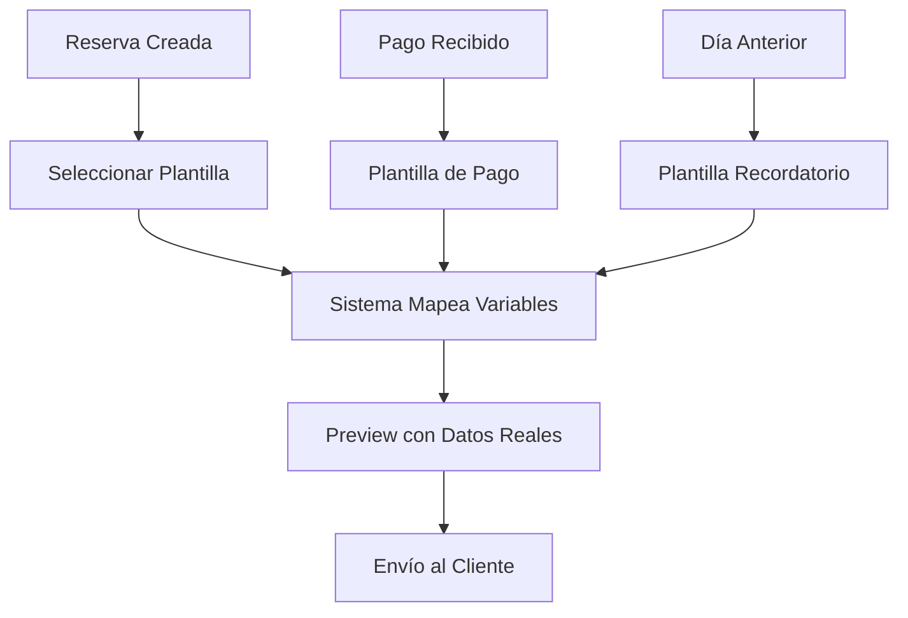

# Plantillas de Email para Reservas

## Resumen

Se han implementado **3 plantillas profesionales** de email para el sistema de reservas, integradas completamente con el módulo de emails centralizado. Estas plantillas utilizan el mismo sistema de variables que las plantillas de presupuesto.

## Plantillas Disponibles

### 1. Confirmación de Reserva (`reservation_confirmation`)
- **Propósito**: Enviar confirmación inmediata al cliente cuando se realiza una reserva
- **Cuándo usar**: Al confirmar una nueva reserva
- **Diseño**: Estilo profesional con colores corporativos (#2c5530)
- **Información incluida**:
  - Datos del cliente y empresa
  - Detalles completos de la reserva
  - Información de contacto y ubicación
  - Instrucciones básicas

### 2. Confirmación de Pago (`payment_confirmation`)
- **Propósito**: Confirmar la recepción de pagos relacionados con la reserva
- **Cuándo usar**: Cuando se registra un pago (parcial o total)
- **Diseño**: Incluye elementos visuales de confirmación (✅)
- **Información incluida**:
  - Detalles del pago realizado
  - Estado financiero de la reserva
  - Saldo restante (si aplica)
  - Confirmación visual del pago

### 3. Recordatorio de Reserva (`reservation_reminder`)
- **Propósito**: Recordar al cliente sobre su próxima estadía
- **Cuándo usar**: 1-2 días antes del check-in
- **Diseño**: Colores de alerta amigables (#ffc107)
- **Información incluida**:
  - Recordatorio destacado
  - Detalles de la reserva
  - Información práctica para el check-in
  - Lista de elementos importantes a recordar

## Variables Disponibles

### Variables de Cliente
- `nombre_cliente`: Nombre completo del huésped
- `email_cliente`: Correo electrónico del cliente
- `empresa`: Nombre de la empresa (ej: "Termas Llifen")

### Variables de Reserva
- `numero_reserva`: ID único de la reserva
- `fecha_checkin`: Fecha de entrada (formato DD/MM/YYYY)
- `fecha_checkout`: Fecha de salida (formato DD/MM/YYYY)
- `habitacion`: Código o nombre de la habitación
- `paquete`: Tipo de paquete contratado
- `total_reserva`: Monto total de la reserva
- `numero_huespedes`: Cantidad de huéspedes
- `tipo_habitacion`: Tipo de habitación
- `estado_reserva`: Estado actual de la reserva

### Variables de Pago
- `total_pagado`: Monto total pagado hasta la fecha
- `saldo_restante`: Saldo pendiente por pagar
- `fecha_pago`: Fecha del último pago
- `metodo_pago`: Método utilizado para el pago

### Variables de Sistema
- `fecha_actual`: Fecha actual del sistema

## Características Técnicas

### Formato de Plantillas
- **Sintaxis**: Utiliza `{{variable}}` para reemplazo simple
- **Compatibilidad**: Compatible con el motor de plantillas existente
- **Formatos**: Incluye versiones HTML y texto plano
- **Responsive**: Diseño adaptable para dispositivos móviles

### Integración con el Sistema
- **Ubicación**: `src/lib/templates/reservation-templates.ts`
- **Importación**: Automática en el módulo de emails
- **Categoría**: Clasificadas como templates de "client"
- **Attachments**: Configuradas como "none" por defecto

## Uso en el Sistema

### Desde el Módulo de Emails (`/dashboard/emails`)
1. Navegar a la sección "Reservas"
2. Ver las 3 plantillas disponibles
3. Editar o personalizar según necesidades
4. Preview en tiempo real

### Desde el Modal de Reservas
1. Abrir cualquier reserva existente
2. Ir a la pestaña "Email"
3. Seleccionar plantilla deseada
4. Sistema autocompleta variables con datos reales
5. Preview antes de enviar
6. Envío directo al cliente

## Flujo de Trabajo



## Beneficios de la Implementación

### Para el Usuario
- **Consistencia**: Mismo diseño y calidad en todos los emails
- **Eficiencia**: Templates precargados, solo seleccionar y enviar
- **Personalización**: Variables automáticas con datos reales
- **Preview**: Vista previa antes del envío

### Para el Sistema
- **Centralización**: Todas las plantillas en un solo lugar
- **Mantenimiento**: Fácil actualización desde `/dashboard/emails`
- **Escalabilidad**: Base para futuras plantillas
- **Integración**: Utiliza la infraestructura existente

## Configuración de Variables

El sistema mapea automáticamente los datos de la reserva a las variables de las plantillas:

```typescript
const getTemplateData = () => ({
  // Variables de cliente
  nombre_cliente: reservation.guest_name || 'Estimado/a Cliente',
  email_cliente: reservation.guest_email || '',
  empresa: 'Termas Llifen',
  
  // Variables de reserva
  numero_reserva: reservation.id?.toString() || 'No especificado',
  fecha_checkin: reservation.check_in ? new Date(reservation.check_in).toLocaleDateString('es-CL') : 'No especificada',
  fecha_checkout: reservation.check_out ? new Date(reservation.check_out).toLocaleDateString('es-CL') : 'No especificada',
  habitacion: reservation.room_code || 'No especificada',
  paquete: reservation.package_name || 'Paquete no especificado',
  total_reserva: reservation.total_amount || 0,
  
  // Variables de pago
  monto_pagado: reservation.paid_amount || 0,
  total_pagado: reservation.paid_amount || 0,
  saldo_restante: (reservation.total_amount || 0) - (reservation.paid_amount || 0),
  
  // Variables de fecha
  fecha_actual: new Date().toLocaleDateString('es-CL')
});
```

## Estado de Implementación

✅ **Completado**: 
- 3 plantillas profesionales creadas
- Integración con módulo de emails
- Sistema de variables automático
- Preview en tiempo real
- Documentación completa

✅ **Funcionalidades**:
- Mapeo automático de datos
- Disponibilidad condicional (ej: pago solo si hay monto)
- Diseño responsive
- Compatibilidad con motor de plantillas

## Próximos Pasos Sugeridos

1. **Testing**: Probar envío real de emails con clientes
2. **Feedback**: Recopilar comentarios sobre diseño y contenido
3. **Expansión**: Considerar plantillas adicionales:
   - Cancelación de reserva
   - Modificación de reserva
   - Encuesta post-estadía
4. **Automatización**: Configurar envíos automáticos para recordatorios

---

**Fecha de Implementación**: Enero 2025  
**Estado**: ✅ Producción  
**Mantenedor**: Módulo de Emails 