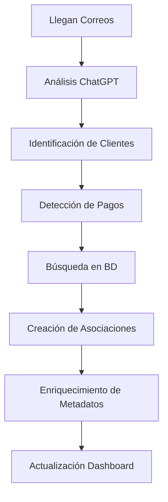

# Sistema de Identificación de Clientes en Correos Electrónicos

## 📋 Resumen Ejecutivo

Se implementó un sistema completo de identificación y seguimiento de clientes a través del análisis de correos electrónicos. Permite asociar automáticamente correos recibidos con clientes registrados y detectar pagos de reservas para un seguimiento integral de las comunicaciones.

## 🎯 Características Principales

### 🔍 Identificación Automática de Clientes
- **Búsqueda por email**: Verifica automáticamente si el remitente es un cliente registrado
- **Búsqueda en contactos**: Incluye búsqueda en tabla `ClientContact` 
- **Historial de reservas**: Muestra resumen de reservas del cliente (total, confirmadas, pendientes)
- **Información completa**: ID, nombre, teléfono, RUT, fecha de registro

### 💰 Detección Inteligente de Pagos
- **Palabras clave**: Detecta "pago", "transferencia", "depósito", "comprobante", "abono"
- **Extracción de montos**: Identifica cantidades mencionadas ($50.000, 50000, etc.)
- **Métodos de pago**: Clasifica entre transferencia, depósito, tarjeta, efectivo
- **Fechas de reserva**: Extrae fechas mencionadas en el correo
- **Prioridad alta**: Los correos de pago tienen máxima prioridad

### 🏨 Asociación Correo-Cliente-Reserva
- **Tracking completo**: Cada correo se asocia con el cliente correspondiente
- **Historial unificado**: Permite ver todas las comunicaciones por cliente
- **Metadatos enriquecidos**: Información adicional sobre pagos y reservas
- **Estado de asociación**: Confirmación de vinculación exitosa

## 🛠️ Arquitectura Técnica

### Base de Datos

#### Tabla EmailClientAssociation
```sql
CREATE TABLE "EmailClientAssociation" (
    "id" BIGSERIAL PRIMARY KEY,
    "emailAnalysisId" BIGINT REFERENCES "EmailAnalysis"("id"),
    "clientId" BIGINT REFERENCES "Client"("id"),
    "senderEmail" TEXT NOT NULL,
    "subject" TEXT,
    "isPaymentRelated" BOOLEAN DEFAULT false,
    "reservationId" BIGINT REFERENCES "reservations"("id"),
    "paymentAmount" DECIMAL(12,2),
    "paymentMethod" TEXT,
    "notes" TEXT,
    "createdAt" TIMESTAMPTZ DEFAULT NOW()
);
```

#### Funciones SQL Creadas
- `find_client_by_email(email)`: Busca cliente por email con resumen de reservas
- `get_client_recent_reservations(client_id)`: Obtiene últimas reservas del cliente
- `associate_email_with_client()`: Crea asociación correo-cliente

### Backend - Server Actions

#### client-analysis-actions.ts
- `findClientByEmail()`: Búsqueda de cliente por email
- `getClientRecentReservations()`: Reservas recientes del cliente
- `associateEmailWithClient()`: Crear asociación
- `analyzeEmailsForClients()`: Análisis completo automático
- `extractPaymentInfo()`: Detección de información de pagos

#### analysis-actions.ts (Modificado)
- Integración automática en `analyzeEmailsToday()`
- Ejecución paralela del análisis de clientes
- Enriquecimiento de metadatos con información de clientes

### Frontend - Componentes

#### ClientEmailAssociations.tsx
- **Estadísticas en tiempo real**: Correos de clientes, pagos detectados, total de pagos
- **Sección de pagos prioritaria**: Correos con pagos destacados en verde
- **Lista expandible**: Otros correos de clientes
- **Información detallada**: Cliente, email, teléfono, fecha
- **Formato de moneda**: Presentación en pesos chilenos

#### EmailDashboard.tsx (Integrado)
- Sección dedicada para clientes identificados
- Carga automática de asociaciones recientes
- Integración visual con el dashboard existente

### APIs

#### /api/emails/client-associations
- **GET**: Obtener asociaciones por análisis o recientes
- **Filtros**: Por análisis específico, recientes (24h), límite de resultados
- **JOIN con Cliente**: Información completa del cliente
- **Ordenamiento**: Por fecha de creación descendente

## 🔄 Flujo de Funcionamiento

### 1. Análisis Automático


### 2. Detección de Clientes
1. **Extracción de email**: Del campo `from.address` del correo
2. **Búsqueda en BD**: Usando función `find_client_by_email()`
3. **Búsqueda en contactos**: Incluye tabla `ClientContact`
4. **Obtención de historial**: Resumen de reservas del cliente
5. **Creación de asociación**: Si el cliente existe

### 3. Detección de Pagos
1. **Análisis de contenido**: Busca palabras clave de pago
2. **Extracción de montos**: Patrones numéricos y monetarios
3. **Identificación de método**: Transferencia, depósito, etc.
4. **Fechas de reserva**: Patrones de fecha mencionados
5. **Marcado de prioridad**: `isPaymentRelated = true`

## 📊 Prompts Mejorados

### Prompt Principal (analysis-config.ts)
```text
IMPORTANTE: Para cada correo, identifica si el remitente podría ser un CLIENTE REGISTRADO del hotel y si menciona PAGOS o TRANSFERENCIAS.

Enfócate especialmente en:
- 💰 PAGOS Y TRANSFERENCIAS (MÁXIMA PRIORIDAD)
- 👥 IDENTIFICACIÓN DE CLIENTES
- 🏨 Reservas y consultas de alojamiento
```

### Plantilla Especializada (clientTracking)
- **Identificación por remitente**: Email exacto y nombre detectado
- **Clasificación de comunicación**: Pago/Reserva/Consulta/Queja
- **Detección de pagos**: Monto, método, fechas
- **Verificación requerida**: Marca correos que necesitan verificación en BD

## 📈 Beneficios Implementados

### Para el Hotel
1. **Seguimiento completo**: Historial unificado por cliente
2. **Detección automática de pagos**: No se pierden confirmaciones
3. **Priorización inteligente**: Pagos tienen máxima prioridad
4. **Servicio personalizado**: Información del cliente al alcance
5. **Eficiencia operacional**: Reducción de tiempo en asociar comunicaciones

### Para el Personal
1. **Dashboard centralizado**: Toda la información en un lugar
2. **Alertas visuales**: Pagos destacados en verde
3. **Información contextual**: Historial de reservas visible
4. **Navegación intuitiva**: Listas expandibles y organizadas
5. **Estadísticas en tiempo real**: Métricas de clientes y pagos

## 🔍 Archivos Implementados

### Migraciones
- `supabase/migrations/20250118000001_create_email_client_association.sql`

### Server Actions
- `src/actions/emails/client-analysis-actions.ts` (NUEVO)
- `src/actions/emails/analysis-actions.ts` (MODIFICADO)
- `src/actions/emails/analysis-config.ts` (MODIFICADO)

### Componentes
- `src/components/emails/ClientEmailAssociations.tsx` (NUEVO)
- `src/components/emails/EmailDashboard.tsx` (MODIFICADO)

### APIs
- `src/app/api/emails/client-associations/route.ts` (NUEVO)

### Utilidades
- `src/utils/email-analysis-utils.ts` (MODIFICADO - nuevas plantillas)

## 📋 Instrucciones de Despliegue

### 1. Aplicar Migración
```sql
-- Ejecutar en Supabase SQL Editor
-- Archivo: supabase/migrations/20250118000001_create_email_client_association.sql
```

### 2. Variables de Entorno
Las variables existentes siguen funcionando. El sistema se integra automáticamente.

### 3. Verificación
1. **Análisis de correos**: Ejecutar análisis y verificar metadatos
2. **Dashboard**: Revisar sección "Clientes Identificados"
3. **Asociaciones**: Verificar creación de registros en BD
4. **APIs**: Probar `/api/emails/client-associations`

## 🚀 Estado del Sistema

### ✅ Completado
- [x] Migración de base de datos
- [x] Funciones SQL de búsqueda
- [x] Server actions de análisis de clientes
- [x] Integración en análisis principal
- [x] Componente visual de asociaciones
- [x] API de consulta de asociaciones
- [x] Prompts mejorados con identificación
- [x] Dashboard integrado
- [x] Documentación completa

### 🎯 Próximos Pasos Sugeridos
1. **Integración en perfil de cliente**: Mostrar correos asociados en `/dashboard/customers/[id]`
2. **Notificaciones automáticas**: Alertas cuando llegan pagos de clientes VIP
3. **Reportes de comunicaciones**: Analytics de interacciones por cliente
4. **Automatización de respuestas**: Confirmaciones automáticas de recepción de pagos

## 🔧 Configuración Avanzada

### Personalización de Detección
- **Palabras clave adicionales**: Modificar array en `extractPaymentInfo()`
- **Patrones de montos**: Ajustar regex según formatos locales
- **Métodos de pago**: Agregar nuevos métodos detectables

### Optimización de Performance
- **Índices de BD**: Ya incluidos en migración para consultas eficientes
- **Caché de clientes**: Considerar caché en Redis para clientes frecuentes
- **Batch processing**: Análisis en lotes para gran volumen de correos

## 📞 Soporte Técnico

### Logs de Debugging
- Console logs detallados en todas las funciones
- Identificación clara de errores vs warnings
- Tracking de performance en análisis

### Monitoreo
- Estadísticas en dashboard de asociaciones creadas
- Métricas de éxito en detección de pagos
- Alertas visuales para errores de asociación

---

**Sistema implementado el: 18 de enero, 2025**  
**Versión: 1.0**  
**Status: Producción Ready ✅** 