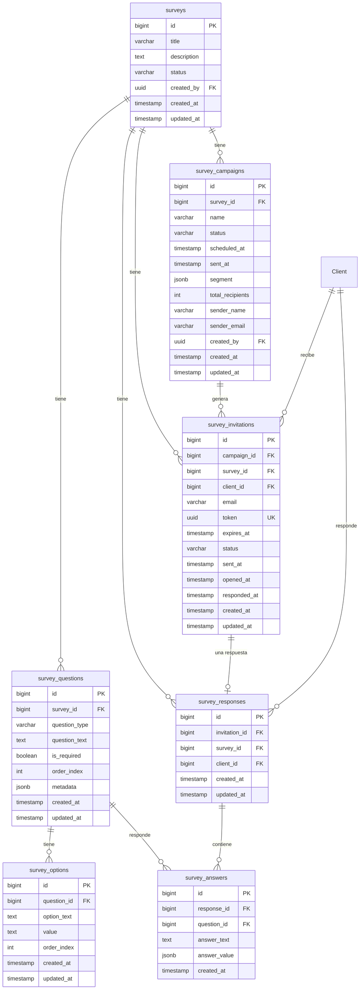

# 🏗️ Arquitectura Técnica - Módulo de Encuestas

## 📋 Resumen

El módulo de encuestas está construido siguiendo la arquitectura existente de Admintermas, utilizando Next.js 15, Supabase, TypeScript y el patrón de Server Actions + API Routes para máxima compatibilidad con Vercel.

---

## 🗄️ Base de Datos

### Esquema Relacional



### Índices de Performance

```sql
-- Índices principales para optimización
CREATE INDEX idx_survey_questions_survey ON survey_questions(survey_id, order_index);
CREATE INDEX idx_survey_options_question ON survey_options(question_id, order_index);
CREATE INDEX idx_survey_campaigns_survey ON survey_campaigns(survey_id, status);
CREATE INDEX idx_survey_invitations_campaign ON survey_invitations(campaign_id);
CREATE INDEX idx_survey_invitations_token ON survey_invitations(token);
CREATE INDEX idx_survey_responses_survey ON survey_responses(survey_id);
CREATE INDEX idx_survey_answers_response ON survey_answers(response_id);
```

### Políticas RLS (Row Level Security)

```sql
-- Políticas para usuarios autenticados
CREATE POLICY "auth users can select surveys" ON surveys 
    FOR SELECT USING (auth.role() = 'authenticated');

CREATE POLICY "auth users can insert surveys" ON surveys 
    FOR INSERT WITH CHECK (auth.role() = 'authenticated');

CREATE POLICY "auth users can update surveys" ON surveys 
    FOR UPDATE USING (auth.role() = 'authenticated');

CREATE POLICY "auth users can delete surveys" ON surveys 
    FOR DELETE USING (auth.role() = 'authenticated');
```

---

## ⚡ Server Actions

### Arquitectura de Acciones

```typescript
// Patrón estándar de Server Actions
'use server';

export async function actionName(input: InputType): Promise<ActionResult> {
  try {
    // 1. Validación de entrada
    // 2. Conexión a Supabase
    // 3. Operación de base de datos
    // 4. Logging
    // 5. Retorno de resultado
  } catch (error) {
    // Manejo de errores con logging
    return { success: false, error: error.message };
  }
}
```

### Funciones Principales

**CRUD de Encuestas:**
```typescript
// Crear encuesta
createSurvey(input: CreateSurveyInput): Promise<ActionResult<Survey>>

// Listar encuestas
listSurveys(): Promise<ActionResult<Survey[]>>

// Obtener encuesta con preguntas
getSurveyWithQuestions(surveyId: number): Promise<ActionResult<SurveyWithQuestions>>
```

**Gestión de Preguntas:**
```typescript
// Agregar pregunta
addQuestion(input: AddQuestionInput): Promise<ActionResult<SurveyQuestion>>

// Input incluye opciones para preguntas de selección
interface AddQuestionInput {
  survey_id: number;
  question_type: QuestionType;
  question_text: string;
  is_required?: boolean;
  order_index?: number;
  options?: Array<{
    option_text: string;
    value?: string;
    order_index?: number;
  }>;
}
```

**Campañas y Envío:**
```typescript
// Crear campaña
createCampaign(input: CreateCampaignInput): Promise<ActionResult<SurveyCampaign>>

// Enviar invitaciones masivas
sendSurveyInvitations(campaignId: number): Promise<ActionResult<{sent: number; failed: number}>>
```

**Respuestas:**
```typescript
// Obtener invitación por token
getInvitationByToken(token: string): Promise<ActionResult<SurveyInvitation>>

// Enviar respuestas
submitSurveyAnswers(input: SubmitSurveyAnswersInput): Promise<ActionResult<{response: SurveyResponse}>>
```

---

## 🌐 API Routes

### Patrón Híbrido Server Actions + API Routes

Siguiendo el patrón establecido en el sistema para máxima compatibilidad con Vercel:

```typescript
// API Route como fallback
export async function POST(request: NextRequest) {
  try {
    // 1. Verificar autenticación
    const user = await getCurrentUser();
    if (!user) return unauthorized();

    // 2. Validar entrada
    const body = await request.json();
    if (!validateInput(body)) return badRequest();

    // 3. Llamar Server Action
    const result = await serverAction(body);
    
    // 4. Retornar resultado
    return NextResponse.json(result);
  } catch (error) {
    return internalServerError();
  }
}
```

### Endpoints Implementados

**POST `/api/surveys/invite`** - Crear campaña
```typescript
// Input
{
  survey_id: number;
  name: string;
  scheduled_at?: string;
  sender_name?: string;
  sender_email?: string;
  clientIds?: number[];
}

// Output
{
  success: boolean;
  data?: SurveyCampaign;
  error?: string;
}
```

**POST `/api/surveys/send`** - Enviar invitaciones
```typescript
// Input
{
  campaignId: number;
}

// Output
{
  success: boolean;
  sent: number;
  failed: number;
  error?: string;
}
```

**POST `/api/surveys/respond`** - Enviar respuestas
```typescript
// Input (JSON)
{
  token: string;
  answers: Array<{
    question_id: number;
    answer_text?: string;
    answer_value?: unknown;
  }>;
}

// Input (Form)
// Campos: token, q_{id}_text, q_{id}_single, q_{id}_multi, q_{id}_rating

// Output
{
  success: boolean;
  data?: { response: SurveyResponse };
  error?: string;
}
```

---

## 🎨 Frontend Architecture

### Estructura de Componentes

```
src/
├── app/
│   ├── dashboard/marketing/surveys/
│   │   ├── page.tsx                    # Lista de encuestas
│   │   └── [id]/page.tsx              # Configuración de encuesta
│   └── surveys/
│       ├── [token]/page.tsx           # Formulario público
│       └── thanks/page.tsx            # Página de agradecimiento
├── actions/surveys/
│   └── index.ts                       # Server Actions
├── types/
│   └── surveys.ts                     # Tipos TypeScript
└── app/api/surveys/
    ├── invite/route.ts                # Crear campaña
    ├── send/route.ts                  # Enviar invitaciones
    └── respond/route.ts               # Enviar respuestas
```

### Patrón de Páginas

**Páginas Administrativas:**
```typescript
// Server Component con Server Actions
export default async function SurveysPage() {
  const surveys = await listSurveys();
  
  async function create(formData: FormData) {
    'use server';
    const result = await createSurvey(extractData(formData));
    if (result.success) redirect('/dashboard/marketing/surveys');
  }
  
  return (
    <form action={create}>
      {/* Formulario */}
    </form>
  );
}
```

**Páginas Públicas:**
```typescript
// Server Component para formulario público
export default async function SurveyPage({ params }: { params: { token: string } }) {
  const invitation = await getInvitationByToken(params.token);
  const survey = await getSurveyWithQuestions(invitation.survey_id);
  
  return (
    <form action="/api/surveys/respond" method="post">
      <input type="hidden" name="token" value={params.token} />
      {/* Preguntas dinámicas */}
    </form>
  );
}
```

---

## 📧 Integración Email

### Servicio de Email

Utiliza el servicio existente `src/lib/email-service.ts`:

```typescript
import { sendCustomEmail } from '@/actions/emails/email-actions';

// Enviar invitación individual
const result = await sendCustomEmail(
  invitation.email,
  `Encuesta: ${survey.title}`,
  generateEmailHTML(survey, token),
  true // isHtml
);
```

### Plantilla de Email

```html
<div style="font-family: Arial, sans-serif; line-height: 1.5;">
  <h2>Hola, queremos conocer tu opinión</h2>
  <p>{{survey.description}}</p>
  <p>
    <a href="{{link}}" style="background:#16a34a;color:#fff;padding:12px 18px;text-decoration:none;border-radius:6px;display:inline-block">
      Responder encuesta
    </a>
  </p>
  <p>Si el botón no funciona, copia y pega este enlace:<br/>
  <a href="{{link}}">{{link}}</a></p>
  <hr/>
  <p style="font-size:12px;color:#666;">
    Enviado por {{sender_name}} ({{sender_email}})
  </p>
</div>
```

### Envío Masivo

```typescript
// Procesamiento por lotes
export async function sendSurveyInvitations(campaignId: number) {
  const invitations = await getPendingInvitations(campaignId);
  let sent = 0, failed = 0;
  
  for (const invitation of invitations) {
    const result = await sendCustomEmail(/* ... */);
    if (result.success) {
      sent++;
      await markAsSent(invitation.id);
    } else {
      failed++;
      await markAsBounced(invitation.id);
    }
  }
  
  return { success: true, sent, failed };
}
```

---

## 🔒 Seguridad

### Autenticación y Autorización

```typescript
// Verificación de usuario autenticado
const user = await getCurrentUser();
if (!user) {
  return NextResponse.json({ error: 'No autorizado' }, { status: 401 });
}

// Verificación de rol de administrador (en UI)
const isAdmin = await isAdminUser();
if (!isAdmin) {
  return notFound(); // O redirigir
}
```

### Tokens Únicos

```sql
-- Generación de token único por invitación
token UUID NOT NULL DEFAULT gen_random_uuid(),
UNIQUE(token)
```

### Validación de Entrada

```typescript
// Validación en Server Actions
if (!input.title || input.title.trim().length === 0) {
  return { success: false, error: 'Título requerido' };
}

// Validación de email
const emailRegex = /^[^\s@]+@[^\s@]+\.[^\s@]+$/;
if (!emailRegex.test(email)) {
  return { success: false, error: 'Email inválido' };
}
```

### Protección CSRF

```typescript
// Server Actions son inmunes a CSRF por diseño
'use server';

// API Routes requieren verificación de origen
const origin = request.headers.get('origin');
if (origin !== process.env.NEXT_PUBLIC_APP_URL) {
  return NextResponse.json({ error: 'Origen no permitido' }, { status: 403 });
}
```

---

## 📊 Performance

### Optimizaciones de Base de Datos

```sql
-- Índices para consultas frecuentes
CREATE INDEX idx_survey_invitations_token ON survey_invitations(token);
CREATE INDEX idx_survey_questions_survey ON survey_questions(survey_id, order_index);

-- Consultas optimizadas
SELECT s.*, 
       COUNT(DISTINCT si.id) as total_invitations,
       COUNT(DISTINCT sr.id) as total_responses
FROM surveys s
LEFT JOIN survey_invitations si ON s.id = si.survey_id
LEFT JOIN survey_responses sr ON si.id = sr.invitation_id
GROUP BY s.id;
```

### Caching

```typescript
// Cache de encuestas activas
const cache = new Map<string, SurveyWithQuestions>();

export async function getSurveyWithQuestions(surveyId: number) {
  const cacheKey = `survey-${surveyId}`;
  
  if (cache.has(cacheKey)) {
    return cache.get(cacheKey);
  }
  
  const result = await fetchSurveyFromDB(surveyId);
  cache.set(cacheKey, result);
  return result;
}
```

### Lazy Loading

```typescript
// Carga diferida de respuestas
export async function getSurveyResponses(surveyId: number, page = 1) {
  const limit = 50;
  const offset = (page - 1) * limit;
  
  return await supabase
    .from('survey_responses')
    .select('*, survey_answers(*)')
    .eq('survey_id', surveyId)
    .range(offset, offset + limit - 1);
}
```

---

## 🧪 Testing

### Estrategia de Testing

```typescript
// Unit Tests para Server Actions
describe('createSurvey', () => {
  it('should create survey with valid input', async () => {
    const input = { title: 'Test Survey', description: 'Test Description' };
    const result = await createSurvey(input);
    
    expect(result.success).toBe(true);
    expect(result.data?.title).toBe('Test Survey');
  });
  
  it('should fail with invalid input', async () => {
    const input = { title: '', description: 'Test Description' };
    const result = await createSurvey(input);
    
    expect(result.success).toBe(false);
    expect(result.error).toContain('Título requerido');
  });
});
```

### Integration Tests

```typescript
// Tests de API Routes
describe('/api/surveys/respond', () => {
  it('should accept valid survey response', async () => {
    const response = await fetch('/api/surveys/respond', {
      method: 'POST',
      headers: { 'Content-Type': 'application/json' },
      body: JSON.stringify({
        token: 'valid-token',
        answers: [{ question_id: 1, answer_text: 'Test answer' }]
      })
    });
    
    expect(response.status).toBe(200);
    const data = await response.json();
    expect(data.success).toBe(true);
  });
});
```

---

## 🚀 Deployment

### Variables de Entorno

```env
# Producción
NEXT_PUBLIC_APP_URL=https://admintermas.vercel.app
GMAIL_USER=reservas@termasllifen.cl
GMAIL_APP_PASSWORD=your_production_password

# Desarrollo
NEXT_PUBLIC_APP_URL=http://localhost:3000
GMAIL_USER=test@example.com
GMAIL_APP_PASSWORD=your_dev_password
```

### Migración de Base de Datos

```sql
-- Script de migración
-- Ejecutar en Supabase SQL Editor (NO usar supabase db reset)

-- 1. Crear tablas
-- 2. Crear índices
-- 3. Habilitar RLS
-- 4. Crear políticas
-- 5. Crear triggers
```

### Monitoreo

```typescript
// Logging estructurado
console.log('📊 Survey created:', {
  surveyId: result.data?.id,
  title: result.data?.title,
  userId: user.id,
  timestamp: new Date().toISOString()
});

// Métricas de performance
console.time('survey-creation');
const result = await createSurvey(input);
console.timeEnd('survey-creation');
```

---

*Documentación técnica actualizada: Enero 2025*
