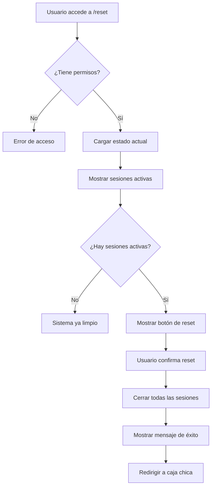

# Sistema de Reset de Caja Chica

## Descripción
Sistema completo para cerrar sesiones activas de caja chica y empezar desde cero con datos reales, manteniendo el historial pero permitiendo un nuevo inicio limpio.

## Acceso al Sistema

### URL de Acceso
```
http://localhost:3000/dashboard/pettyCash/reset
```

### Acceso Desde Dashboard
- **Botón en Caja Chica**: Los administradores ven un botón "🧹 Reset" en el dashboard principal
- **Ubicación**: Header superior derecho junto a Historial y otras acciones
- **Color**: Botón naranja distintivo para evitar confusión

### Permisos Requeridos
- ✅ **SUPER_USER** (Acceso completo)
- ✅ **ADMINISTRADOR** (Acceso completo)
- ❌ **CAJERO** (Sin acceso)
- ❌ **USUARIO** (Sin acceso)

## Funcionalidades

### 1. Visualización del Estado Actual
- **Sesiones Activas**: Muestra cuántas sesiones están abiertas
- **Gastos Registrados**: Total de gastos en el sistema
- **Compras Registradas**: Total de compras en el sistema
- **Detalle de Sesiones**: Tabla con información de cada sesión activa

### 2. Reset Automático
- **Cierre Seguro**: Cierra todas las sesiones activas
- **Conservación de Datos**: Mantiene historial de gastos y compras
- **Efectivo Final**: Establece efectivo final igual al inicial
- **Notas Automáticas**: Marca las sesiones como cerradas por reset

### 3. Guía de Siguientes Pasos
- Instrucciones claras para empezar desde cero
- Enlaces directos a la página principal
- Recomendaciones para datos reales

## Archivos del Sistema

### Estructura de Archivos
```
src/
├── app/dashboard/pettyCash/reset/
│   └── page.tsx                          # Página principal del reset
├── components/petty-cash/
│   └── ResetCashSessionPage.tsx          # Componente de interfaz
└── actions/configuration/
    └── reset-cash-actions.ts             # Funciones del servidor
```

### Archivos Creados

#### 1. `/src/app/dashboard/pettyCash/reset/page.tsx`
```typescript
// Página de reset con verificación de permisos
// Solo accesible para SUPER_USER y ADMINISTRADOR
```

#### 2. `/src/components/petty-cash/ResetCashSessionPage.tsx`
```typescript
// Interfaz visual completa para el reset
// Muestra estado actual y permite ejecutar reset
```

#### 3. `/src/actions/configuration/reset-cash-actions.ts`
```typescript
// Funciones del servidor:
// - getCashSessionStatus(): Obtiene estado actual
// - resetCashSessions(): Cierra todas las sesiones
// - cleanTestData(): Limpia datos de prueba (opcional)
```

## Flujo de Uso

### Proceso Completo


### Pasos para el Usuario

1. **Acceder al Reset**
   ```
   Opción A: Ir a http://localhost:3000/dashboard/pettyCash/reset
   Opción B: Hacer clic en botón "🧹 Reset" en dashboard de caja chica (solo admins)
   ```

2. **Revisar Estado Actual**
   - Ver sesiones activas
   - Verificar gastos y compras registrados
   - Confirmar que quiere hacer reset

3. **Ejecutar Reset**
   - Hacer clic en "Cerrar Todas las Sesiones Activas"
   - Confirmar la acción en el diálogo
   - Esperar confirmación de éxito

4. **Empezar Desde Cero**
   - Ir a `/dashboard/pettyCash`
   - Hacer clic en "Abrir Nueva Sesión"
   - Ingresar monto inicial real
   - Registrar solo transacciones reales

## Características de Seguridad

### 1. Verificación de Permisos
```typescript
// Solo administradores pueden acceder
if (currentUser.role !== 'SUPER_USER' && currentUser.role !== 'ADMINISTRADOR') {
  throw new Error('No tienes permisos para acceder a esta sección');
}
```

### 2. Confirmación Requerida
```typescript
// Confirmación antes de ejecutar reset
if (!confirm('⚠️ ¿Estás seguro de que quieres cerrar todas las sesiones activas?')) {
  return;
}
```

### 3. Proceso No Destructivo
- ✅ **Mantiene historial** de gastos y compras
- ✅ **Conserva datos** de usuarios y configuración
- ✅ **Solo cierra sesiones** activas
- ✅ **Marca claramente** el motivo del cierre

## Datos Preservados vs Modificados

### ✅ Datos Preservados
- **Gastos registrados**: Se mantienen en el historial
- **Compras registradas**: Se mantienen en el historial
- **Usuarios**: Información de usuarios intacta
- **Configuración**: Categorías, centros de costo, etc.
- **Historial**: Todas las sesiones cerradas anteriormente

### 🔄 Datos Modificados
- **Sesiones activas**: Cambian de `open` a `closed`
- **Fecha de cierre**: Se establece automáticamente
- **Efectivo final**: Se iguala al efectivo inicial
- **Notas**: Se agrega nota de "RESET DEL SISTEMA"

## Mensajes del Sistema

### Mensaje de Éxito
```
✅ Reset completado exitosamente!

📊 Sesiones cerradas: X
📋 IDs de sesiones: 1, 2, 3

🧹 El sistema está ahora limpio y listo para empezar desde cero.

Siguientes pasos:
1. Ve a la página principal de Caja Chica
2. Haz clic en "Abrir Nueva Sesión"
3. Ingresa el monto inicial real
4. Registra solo transacciones reales
```

### Mensaje cuando No Hay Sesiones
```
✅ Sistema Limpio
No hay sesiones activas. El sistema está listo para empezar desde cero.
```

## Casos de Uso

### 1. **Limpieza de Datos de Prueba**
- **Situación**: Se han creado sesiones de prueba
- **Solución**: Reset elimina sesiones activas de prueba
- **Resultado**: Sistema limpio para datos reales

### 2. **Cambio de Turno Forzado**
- **Situación**: Sesión quedó abierta sin cierre formal
- **Solución**: Reset cierra automáticamente la sesión
- **Resultado**: Nuevo turno puede empezar limpio

### 3. **Error en Sesión Activa**
- **Situación**: Problemas con sesión actual
- **Solución**: Reset permite empezar desde cero
- **Resultado**: Funcionalidad restaurada

### 4. **Inicio de Operaciones Reales**
- **Situación**: Terminar fase de pruebas
- **Solución**: Reset limpia datos de prueba
- **Resultado**: Sistema listo para operación real

## Recomendaciones de Uso

### ✅ Cuándo Usar Reset
- Al terminar fase de pruebas del sistema
- Cuando hay sesiones huérfanas o problemáticas
- Para empezar un nuevo período contable
- Después de datos de demostración

### ❌ Cuándo NO Usar Reset
- En medio de operaciones normales
- Sin verificar que se quiere cerrar sesiones activas
- Si no se tiene respaldo de datos importantes
- Durante horarios de trabajo activo

### 📋 Checklist Pre-Reset
- [ ] Verificar que no hay operaciones en curso
- [ ] Confirmar que se quiere cerrar sesiones activas
- [ ] Asegurar que se tiene el monto inicial real
- [ ] Informar al equipo sobre el reset

## Troubleshooting

### Error: "No tienes permisos"
```
Solución: Solo SUPER_USER y ADMINISTRADOR pueden acceder
Verificar rol del usuario en la base de datos
```

### Error: "Error al obtener sesiones activas"
```
Solución: Verificar conexión a base de datos
Revisar logs del servidor para detalles
```

### No aparecen sesiones para cerrar
```
Verificación: El sistema ya está limpio
Acción: Ir directamente a crear nueva sesión
```

---

**Fecha de Implementación**: Enero 2025  
**Estado**: ✅ **COMPLETAMENTE FUNCIONAL**  
**Versión**: 1.0  
**Mantenedor**: Sistema de Caja Chica