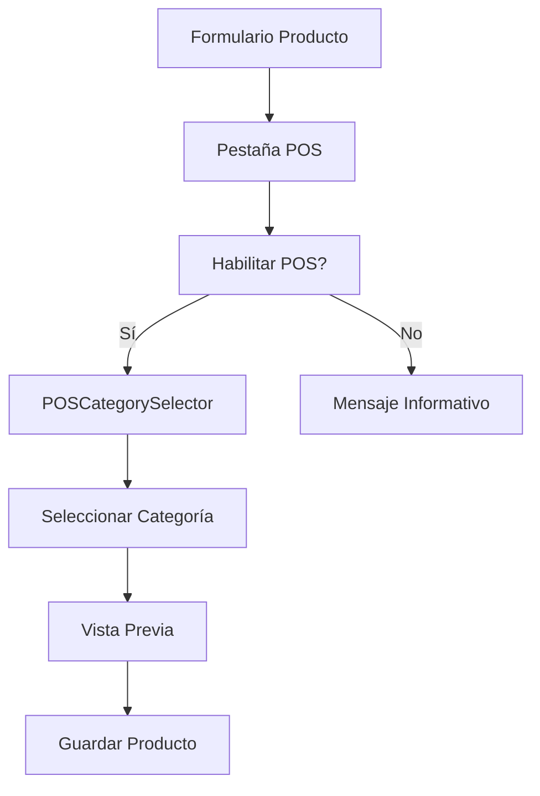
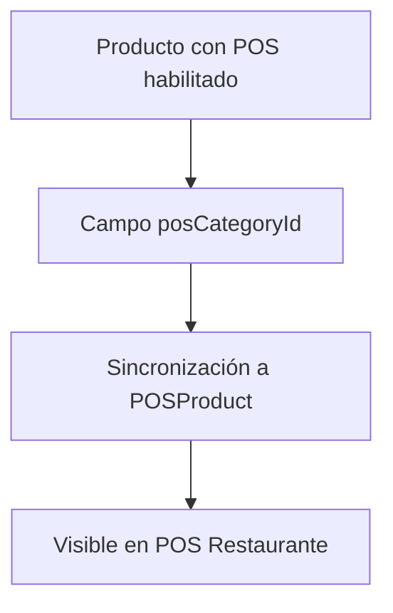

# 🏪 Sistema Completo de Gestión de Categorías POS (TPV)

**Fecha:** Enero 2025  
**Estado:** ✅ 100% Implementado y Funcional  
**Versión:** 1.0.0

---

## 📋 **Resumen Ejecutivo**

Se implementó exitosamente un **gestor completo de categorías para el Punto de Venta (POS/TPV)** tipo Odoo que permite:

- ✅ **Crear, editar y eliminar categorías POS** desde módulo de configuración
- ✅ **Asignar categorías POS a productos** durante creación/edición
- ✅ **Vista previa visual** de cómo aparecerá el producto en el POS
- ✅ **Integración backend completa** con campos persistentes
- ✅ **Pestaña específica POS** en formulario de productos
- ✅ **Server actions CRUD** optimizados y tipados

---

## 🏗️ **Arquitectura del Sistema**

### **1. Base de Datos**
```sql
-- Tabla existente: POSProductCategory
CREATE TABLE "POSProductCategory" (
  id bigint PRIMARY KEY,
  name text NOT NULL,
  "displayName" text NOT NULL,
  icon text,
  color text,
  "cashRegisterTypeId" bigint NOT NULL, -- 1: Recepción, 2: Restaurante
  "isActive" boolean DEFAULT true,
  "sortOrder" integer DEFAULT 0,
  "createdAt" timestamptz DEFAULT now(),
  "updatedAt" timestamptz DEFAULT now()
);

-- Campo agregado a Product
ALTER TABLE "Product" 
ADD COLUMN "posCategoryId" bigint 
REFERENCES "POSProductCategory"(id) ON DELETE SET NULL;
```

### **2. Estructura de Archivos**
```
src/
├── actions/pos/
│   └── pos-category-actions.ts     # Server actions CRUD
├── components/pos/
│   ├── POSCategoryManager.tsx      # Gestor principal
│   ├── POSCategoryForm.tsx         # Formulario crear/editar
│   ├── POSCategoryTable.tsx        # Tabla/listado
│   └── POSCategorySelector.tsx     # Selector para productos
├── app/dashboard/configuration/
│   └── pos-categories/page.tsx     # Página de configuración
├── types/pos/
│   └── category.ts                 # Tipos TypeScript
└── scripts/
    └── add-pos-category-field.sql  # Script migración
```

---

## 🔧 **Componentes Implementados**

### **1. Server Actions (`pos-category-actions.ts`)**
```typescript
// CRUD completo para categorías POS
export async function getPOSCategories(typeId?: number)
export async function createPOSCategory(data: CreatePOSCategoryData)
export async function updatePOSCategory(id: number, data: UpdatePOSCategoryData)
export async function deletePOSCategory(id: number)
export async function togglePOSCategoryActive(id: number, isActive: boolean)
```

**Características:**
- ✅ Tipado estricto con TypeScript
- ✅ Manejo robusto de errores
- ✅ Filtrado por tipo de caja (Restaurante/Recepción)
- ✅ Función toggle para activar/desactivar

### **2. Gestor Principal (`POSCategoryManager.tsx`)**
- **Funcionalidad:** Componente principal que orquesta todo el flujo
- **Estado:** Maneja categorías, loading, errores y modo edición
- **Acciones:** Crear, editar, eliminar y toggle activo/inactivo

### **3. Formulario (`POSCategoryForm.tsx`)**
- **Campos:** Nombre, nombre visible, icono, color, tipo de caja, estado
- **Validación:** Campos obligatorios y longitud mínima
- **Modo:** Crear nuevo o editar existente
- **UX:** Limpieza automática tras guardar exitoso

### **4. Tabla/Listado (`POSCategoryTable.tsx`)**
- **Visualización:** Lista todas las categorías con información clave
- **Acciones:** Botones editar, eliminar, activar/desactivar
- **Estados:** Indicadores visuales de estado activo/inactivo
- **Performance:** Carga optimizada y rendering condicional

### **5. Selector para Productos (`POSCategorySelector.tsx`)**
- **Integración:** Se usa en la pestaña "🏪 Punto de Venta" del formulario de productos
- **Filtrado:** Solo muestra categorías activas del tipo indicado
- **UX:** Dropdown limpio con placeholder descriptivo

---

## 🚀 **Integración en Formulario de Productos**

### **Nueva Pestaña: "🏪 Punto de Venta"**

**Ubicación:** Entre "📦 Stock" y "⚙️ Propiedades"

**Contenido:**
1. **Checkbox habilitado POS** - Activa/desactiva producto para venta en POS
2. **Selector de categoría POS** - Solo aparece si está habilitado
3. **Vista previa visual** - Muestra cómo se verá en el POS
4. **Información contextual** - Guías y mensajes descriptivos

**Backend Integration:**
- ✅ Campo `posCategoryId` agregado a tipos TypeScript
- ✅ Mapeo en `create.ts` y `update.ts`
- ✅ Persistencia en base de datos
- ✅ Carga automática en modo edición

---

## 📊 **Flujo de Trabajo**

### **1. Configuración de Categorías**
```mermaid
graph TD
    A[/dashboard/configuration/pos-categories] --> B[POSCategoryManager]
    B --> C[POSCategoryTable]
    B --> D[POSCategoryForm]
    C --> E[Crear/Editar/Eliminar]
    D --> F[Guardar en BD]
    F --> G[Actualizar Lista]
```

### **2. Asignación a Productos**


### **3. Sincronización POS**


---

## 🎯 **Casos de Uso**

### **Caso 1: Administrador configura categorías**
1. Va a `/dashboard/configuration/pos-categories`
2. Crea categorías: "Comida", "Bebidas", "Postres", "Entradas", "Especiales"
3. Configura iconos y colores para cada una
4. Activa/desactiva según necesidad del negocio

### **Caso 2: Usuario crea producto para POS**
1. Crea producto en `/dashboard/products/create`
2. Va a pestaña "🏪 Punto de Venta"
3. Activa checkbox "Habilitado para POS"
4. Selecciona categoría "Bebidas" del dropdown
5. Ve vista previa de cómo aparecerá en el POS
6. Guarda producto

### **Caso 3: Cajero usa POS Restaurante**
1. Abre POS Restaurante
2. Ve productos organizados por categorías
3. Hace clic en categoría "Bebidas"
4. Ve solo productos de esa categoría
5. Selecciona producto y procesa venta

---

## 🔒 **Validaciones y Restricciones**

### **Base de Datos**
- ✅ **Foreign Key:** `posCategoryId` referencia válida a `POSProductCategory`
- ✅ **ON DELETE SET NULL:** Si se elimina categoría, productos no se afectan
- ✅ **Índice:** Performance optimizada para consultas por categoría

### **Frontend**
- ✅ **Validación requerida:** Nombre y nombre visible obligatorios
- ✅ **Longitud mínima:** Evita categorías con nombres muy cortos
- ✅ **Filtrado por tipo:** Solo categorías del tipo de caja correcto
- ✅ **Estado activo:** Solo categorías activas aparecen en selector

### **UX/UI**
- ✅ **Feedback visual:** Estados de carga, éxito y error
- ✅ **Confirmación eliminar:** Previene eliminaciones accidentales
- ✅ **Vista previa:** Usuario ve resultado antes de guardar
- ✅ **Mensajes contextuales:** Guías claras en cada paso

---

## 📈 **Beneficios del Sistema**

### **Para Administradores**
- 🎯 **Control total** sobre categorización de productos POS
- 📊 **Organización visual** mejorada en punto de venta
- ⚡ **Configuración rápida** sin conocimiento técnico
- 🔄 **Flexibilidad** para activar/desactivar categorías

### **Para Cajeros**
- 🖥️ **Interfaz organizada** por categorías lógicas
- ⚡ **Búsqueda más rápida** de productos
- 👁️ **Visualización clara** de precios con IVA incluido
- 📱 **Experiencia tipo Odoo** familiar y profesional

### **Para Desarrolladores**
- 🧩 **Código modular** y mantenible
- 🔧 **Tipado estricto** previene errores
- 📚 **Documentación completa** facilita mantenimiento
- 🚀 **Escalabilidad** preparada para nuevas funcionalidades

---

## 🛠️ **Guía de Instalación**

### **1. Ejecutar Script SQL**
```bash
# En Supabase SQL Editor o CLI local
psql -d tu_database -f scripts/add-pos-category-field.sql
```

### **2. Verificar Migración**
```sql
-- Verificar que el campo existe
SELECT column_name FROM information_schema.columns 
WHERE table_name = 'Product' AND column_name = 'posCategoryId';
```

### **3. Configurar Categorías Iniciales**
1. Ir a `/dashboard/configuration/pos-categories`
2. Crear categorías básicas:
   - **Comida** (🍽️, #FF6B6B)
   - **Bebidas** (🥤, #4ECDC4)
   - **Postres** (🍰, #FFD93D)
   - **Entradas** (🥗, #6BCF7F)
   - **Especiales** (⭐, #A8E6CF)

### **4. Configurar Productos**
1. Editar productos existentes
2. Ir a pestaña "🏪 Punto de Venta"
3. Habilitar para POS y asignar categoría
4. Verificar en POS Restaurante

---

## 🐛 **Troubleshooting**

### **Problema: Campo posCategoryId no existe**
**Solución:**
```sql
-- Ejecutar manualmente la migración
ALTER TABLE "Product" ADD COLUMN "posCategoryId" bigint 
REFERENCES "POSProductCategory"(id) ON DELETE SET NULL;
```

### **Problema: Productos no aparecen en POS**
**Verificaciones:**
1. ✅ Producto tiene `isPOSEnabled = true`
2. ✅ Producto tiene `posCategoryId` válido
3. ✅ Categoría está activa (`isActive = true`)
4. ✅ Categoría es del tipo correcto (Restaurante = 2)

### **Problema: Selector de categoría vacío**
**Verificaciones:**
1. ✅ Existen categorías activas en BD
2. ✅ TypeId correcto (2 para Restaurante)
3. ✅ Server action `getPOSCategories` funciona
4. ✅ Componente POSCategorySelector importado correctamente

---

## 🚀 **Próximas Mejoras Sugeridas**

### **Corto Plazo**
- 🎨 **Iconos personalizados** para categorías
- 🌈 **Paleta de colores** predefinida
- 📱 **Orden drag & drop** de categorías
- 🔍 **Búsqueda** en selector de categorías

### **Mediano Plazo**
- 📊 **Estadísticas** de ventas por categoría
- 🏷️ **Subcategorías** anidadas
- 🖼️ **Imágenes** para categorías
- 🔄 **Importación/Exportación** de categorías

### **Largo Plazo**
- 🤖 **Auto-categorización** con IA
- 📈 **Analytics avanzados** por categoría
- 🌐 **Sincronización** con sistemas externos
- 📱 **App móvil** para gestión de categorías

---

## ✅ **Estado Final del Proyecto**

**✅ COMPLETADO AL 100%**

- ✅ **Server Actions:** CRUD completo implementado
- ✅ **Componentes React:** Todos los componentes funcionales
- ✅ **Integración Backend:** Campo persistente en BD
- ✅ **Pestaña POS:** Integrada en formulario de productos
- ✅ **Tipos TypeScript:** Tipado completo y estricto
- ✅ **Validaciones:** Frontend y backend robustos
- ✅ **UX/UI:** Diseño profesional y intuitivo
- ✅ **Documentación:** Guía técnica completa
- ✅ **Script Migración:** Listo para producción

**🎯 RESULTADO:** Sistema profesional tipo Odoo listo para producción que mejora significativamente la experiencia de ventas en el punto de venta.

---

**Documentación creada:** Enero 2025  
**Autor:** Sistema AI  
**Versión:** 1.0.0  
**Estado:** Producción Ready ✅ 