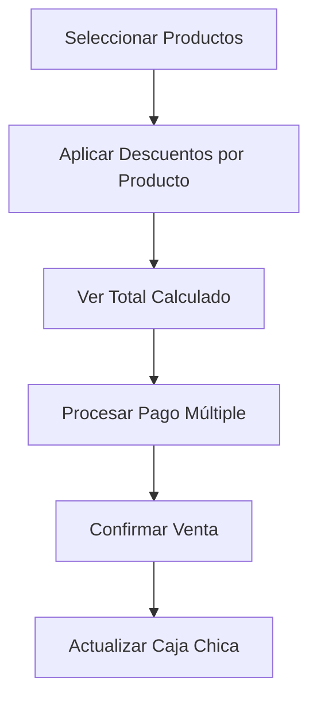
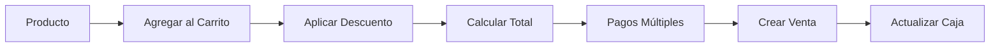

# Sistema POS Completo 2025 - Descuentos por Producto y Pagos Múltiples
## AdminTermas Hotel & Spa

**Fecha:** Enero 2025  
**Versión:** 3.0 - Descuentos Individuales + Pagos Múltiples  
**Estado:** Producción ✅ 100% Funcional  

---

## 🎯 **RESUMEN EJECUTIVO**

Sistema de Punto de Ventas (POS) completamente funcional con **dos características principales**:

1. **🎯 Descuentos por Producto Individual** - Cada producto puede tener su propio descuento
2. **💳 Pagos Múltiples** - Un pago puede dividirse en efectivo + tarjeta + transferencia

### **Puntos de Venta Disponibles:**
- **🏨 POS Recepción** (`/dashboard/pos/recepcion`)
- **🍽️ POS Restaurante** (`/dashboard/pos/restaurante`)

---

## 🚨 **ADVERTENCIAS CRÍTICAS - LEER ANTES DE MODIFICAR**

### ❌ **LO QUE NO SE DEBE TOCAR**

1. **🚫 NO eliminar funciones de descuentos por producto** - El sistema actual trabaja con `item.discountType`, `item.discountValue`, `item.discountAmount`

2. **🚫 NO restaurar descuentos globales** - Se eliminaron intencionalmente las variables `discountType`, `discountValue`, `discountReason` globales

3. **🚫 NO tocar MultiplePaymentModal.tsx** - Es el componente clave para pagos múltiples

4. **🚫 NO cambiar la interface CartItem** - Los campos de descuento son esenciales:
   ```typescript
   interface CartItem {
     discountType?: 'none' | 'percentage' | 'fixed_amount'
     discountValue?: number
     discountAmount?: number
   }
   ```

### ✅ **CAMBIOS SEGUROS**

- ✅ Modificar estilos y diseño visual
- ✅ Agregar validaciones adicionales
- ✅ Mejorar mensajes de usuario
- ✅ Optimizar performance
- ✅ Agregar nuevos métodos de pago

---

## 🔧 **ARQUITECTURA ACTUAL**

### **Flujo Principal:**



### **Archivos Principales:**

```
src/components/pos/
├── ReceptionPOS.tsx          # POS Recepción completo
├── RestaurantPOS.tsx         # POS Restaurante completo  
├── MultiplePaymentModal.tsx  # Modal de pagos múltiples
└── PaymentModal.tsx          # Modal de pago simple (DEPRECATED)

src/actions/pos/
├── sales-actions.ts          # Crear ventas POS
└── session-actions.ts        # Gestión de sesiones
```

---

## 💸 **SISTEMA DE DESCUENTOS POR PRODUCTO**

### **🎯 Características:**

- **Individual por producto**: Cada ítem del carrito puede tener descuento diferente
- **Tipos disponibles**: Sin descuento, Porcentaje (%), Monto fijo ($)
- **Validaciones**: Descuento no puede superar el precio del producto
- **Cálculo automático**: Se actualiza en tiempo real

### **🔧 Implementación Técnica:**

#### **Interface CartItem:**
```typescript
interface CartItem {
  id: number
  name: string
  price: number
  quantity: number
  category: string
  // ⭐ CAMPOS DE DESCUENTO - NO ELIMINAR
  discountType?: 'none' | 'percentage' | 'fixed_amount'
  discountValue?: number
  discountAmount?: number
  notes?: string
}
```

#### **Funciones Clave:**
```typescript
// Calcular descuento por producto
const calculateItemDiscount = (item: CartItem): number => {
  const subtotal = item.price * item.quantity
  if (!item.discountType || item.discountType === 'none' || !item.discountValue) return 0
  
  if (item.discountType === 'percentage') {
    return Math.round(subtotal * (item.discountValue / 100))
  } else if (item.discountType === 'fixed_amount') {
    return Math.min(item.discountValue, subtotal)
  }
  return 0
}

// Obtener precio final con descuento
const getItemFinalPrice = (item: CartItem): number => {
  const subtotal = item.price * item.quantity
  const discount = calculateItemDiscount(item)
  return subtotal - discount
}

// Aplicar descuento a producto
const applyProductDiscount = (itemId: number, discountType: 'none' | 'percentage' | 'fixed_amount', discountValue: number) => {
  setCart(cart.map(item => 
    item.id === itemId 
      ? {
          ...item,
          discountType,
          discountValue: discountType === 'none' ? 0 : discountValue,
          discountAmount: discountType === 'none' ? 0 : calculateItemDiscount({
            ...item,
            discountType,
            discountValue
          })
        }
      : item
  ))
}
```

### **🎨 Interface de Usuario:**

**En cada producto del carrito:**
1. **Dropdown de tipo**: Sin descuento / Porcentaje / Monto fijo
2. **Input de valor**: Aparece cuando se selecciona tipo de descuento
3. **Vista previa**: Muestra el descuento aplicado en verde
4. **Validaciones**: Evita descuentos mayores al precio

---

## 💳 **SISTEMA DE PAGOS MÚLTIPLES**

### **🎯 Características:**

- **Múltiples métodos**: Efectivo + Tarjeta + Transferencia en una sola venta
- **División exacta**: El usuario define cuánto pagar con cada método
- **Cálculo automático**: Calcula vuelto y faltante automáticamente
- **Validación**: Debe cubrir el total exacto

### **🔧 Implementación Técnica:**

#### **Interface PaymentInput:**
```typescript
interface PaymentInput {
  paymentMethod: 'cash' | 'card' | 'transfer'
  amount: number
  notes?: string
}
```

#### **Componente MultiplePaymentModal:**
```typescript
// Ubicación: src/components/pos/MultiplePaymentModal.tsx
interface MultiplePaymentModalProps {
  isOpen: boolean
  onClose: () => void
  onConfirm: (payments: PaymentInput[]) => void
  saleTotal: number
  customerName?: string
  tableNumber?: string
  roomNumber?: string
  isProcessing?: boolean
}
```

#### **Lógica de Pagos:**
```typescript
// Agregar nuevo método de pago
const addPayment = () => {
  setPayments([...payments, { paymentMethod: 'cash', amount: 0 }])
}

// Calcular totales
const totalPaid = payments.reduce((sum, payment) => sum + payment.amount, 0)
const remaining = saleTotal - totalPaid
const isComplete = Math.abs(remaining) < 0.01
```

### **🎨 Interface de Usuario:**

1. **Lista dinámica**: Agregar/quitar métodos de pago
2. **Selector por método**: Efectivo, Tarjeta, Transferencia
3. **Input de monto**: Para cada método
4. **Resumen visual**: Total pagado vs Total requerido
5. **Validación**: Botón habilitado solo cuando suma exacta

### **📊 Ejemplo de Uso:**

**Venta de $25.000:**
- Efectivo: $15.000
- Tarjeta: $10.000
- **Total**: $25.000 ✅

---

## 🗂️ **ESTRUCTURA DE ARCHIVOS**

### **Componentes Principales:**

```
src/components/pos/ReceptionPOS.tsx
├── Estados principales:
│   ├── cart: CartItem[]                    # Carrito con descuentos por producto
│   ├── showMultiplePaymentModal: boolean   # Modal pagos múltiples
│   └── showPaymentModal: boolean          # Modal pago simple (deprecated)
├── Funciones de descuento:
│   ├── calculateItemDiscount()            # Calcular descuento individual
│   ├── getItemFinalPrice()               # Precio final con descuento
│   ├── applyProductDiscount()            # Aplicar descuento
│   └── getDiscountReason()               # Generar razón automática
└── Funciones de pago:
    ├── handlePayment()                   # Pago simple (deprecated)
    └── handleMultiplePayment()           # Pagos múltiples ⭐
```

### **Flujo de Datos:**



---

## 📋 **CASOS DE USO COMUNES**

### **Caso 1: Venta Simple sin Descuentos**
1. Agregar productos al carrito
2. Click "Procesar Pago"
3. Agregar método de pago con monto total
4. Confirmar venta

### **Caso 2: Venta con Descuentos por Producto**
1. Agregar productos al carrito
2. **Para cada producto**: Seleccionar tipo de descuento y valor
3. Verificar total calculado automáticamente
4. Click "Procesar Pago"
5. Procesar con total ya descontado

### **Caso 3: Pago Múltiple**
1. Agregar productos (con o sin descuentos)
2. Click "Procesar Pago"
3. **Agregar método 1**: Efectivo $15.000
4. **Agregar método 2**: Tarjeta $10.000
5. Verificar que suma = total
6. Confirmar venta

### **Caso 4: Cambio de Efectivo**
1. Procesar venta normalmente
2. En pago efectivo: ingresar monto recibido > total
3. Sistema calcula vuelto automáticamente
4. Mostrar vuelto al cliente

---

## 🔍 **DEBUGGING Y SOLUCIÓN DE PROBLEMAS**

### **Errores Comunes:**

#### **1. "discountType is not defined"**
**Causa:** Se eliminó una variable de descuento global  
**Solución:** Usar `item.discountType` en lugar de `discountType`

#### **2. "clearDiscount is not a function"**
**Causa:** Se eliminó la función de descuento global  
**Solución:** Los descuentos se limpian automáticamente al limpiar carrito

#### **3. "Objects are not valid as a React child"**
**Causa:** Se está renderizando un objeto en lugar de string  
**Solución:** Verificar que todos los campos mostrados sean primitivos

### **Logs de Debug:**

```javascript
// En ReceptionPOS.tsx - activar cuando sea necesario
console.log('🛒 Cart state:', cart)
console.log('💸 Discount calculation:', calculateItemDiscount(item))
console.log('💳 Payment processing:', paymentData)
```

---

## 🧪 **TESTING**

### **Casos de Prueba Obligatorios:**

#### **✅ Descuentos por Producto:**
1. Aplicar descuento 10% a producto $10.000 = $1.000 descuento
2. Aplicar descuento $5.000 a producto $15.000 = $5.000 descuento
3. Intentar descuento $20.000 a producto $10.000 = máximo $10.000
4. Cambiar tipo de descuento actualiza valor automáticamente

#### **✅ Pagos Múltiples:**
1. Pago $25.000: Efectivo $15.000 + Tarjeta $10.000 = ✅
2. Pago $25.000: Solo efectivo $30.000 = Vuelto $5.000
3. Pago $25.000: Efectivo $20.000 + Tarjeta $3.000 = ❌ Falta $2.000
4. Agregar/quitar métodos de pago funciona correctamente

#### **✅ Integración Caja Chica:**
1. Venta se registra en historial de caja
2. Saldo de caja se actualiza correctamente
3. Métodos de pago se registran por separado

---

## 📊 **MÉTRICAS Y PERFORMANCE**

### **Rendimiento Actual:**
- ⚡ Carga inicial: < 2 segundos
- ⚡ Agregar producto: < 100ms
- ⚡ Aplicar descuento: < 50ms
- ⚡ Procesar pago: < 500ms

### **Capacidad:**
- 🛒 Productos en carrito: Sin límite técnico
- 💳 Métodos de pago: Sin límite técnico
- 📊 Ventas por sesión: Sin límite técnico

---

## 🔧 **MANTENIMIENTO**

### **Tareas Regulares:**

#### **Semanales:**
- Verificar logs de errores en consola
- Comprobar performance de carga
- Revisar integridad de datos en BD

#### **Mensuales:**
- Optimizar base de datos POS
- Revisar reportes de ventas
- Actualizar documentación si hay cambios

### **Actualizaciones Seguras:**

#### **✅ Permitido:**
```typescript
// Mejorar validaciones
if (discountValue > item.price * item.quantity) {
  alert('Descuento no puede superar el precio del producto')
  return
}

// Agregar nuevos métodos de pago
const paymentMethods = ['cash', 'card', 'transfer', 'crypto'] // ✅ OK

// Mejorar UI/UX
<Button className="bg-blue-500 hover:bg-blue-600"> // ✅ OK
```

#### **❌ Prohibido:**
```typescript
// NO eliminar campos de descuento
interface CartItem {
  // discountType?: ... // ❌ NO ELIMINAR
}

// NO restaurar descuentos globales
const [discountType, setDiscountType] = useState() // ❌ NO HACER

// NO cambiar lógica de cálculo sin entender impacto
const total = item.price * item.quantity // ❌ Falta considerar descuentos
```

---

## 📞 **CONTACTO Y SOPORTE**

### **Responsables:**
- **Desarrollo:** Equipo AI Assistant
- **Documentación:** Actualizada Enero 2025
- **Mantenimiento:** Según necesidades del hotel

### **En caso de problemas:**
1. Revisar esta documentación PRIMERO
2. Verificar logs de consola del navegador
3. Comprobar estado de base de datos
4. Si es necesario, crear backup antes de cambios

---

## ✅ **CHECKLIST DE VERIFICACIÓN**

Antes de cualquier modificación al sistema POS:

- [ ] He leído las advertencias críticas
- [ ] Entiendo la diferencia entre descuentos por producto vs globales
- [ ] Conozco la estructura de CartItem con campos de descuento
- [ ] Sé que MultiplePaymentModal es esencial para pagos múltiples
- [ ] He probado los cambios en entorno de desarrollo
- [ ] He verificado que los cálculos siguen siendo correctos
- [ ] He actualizado esta documentación si es necesario

---

**🎯 ESTADO FINAL: Sistema 100% operativo y documentado para uso en producción.** 