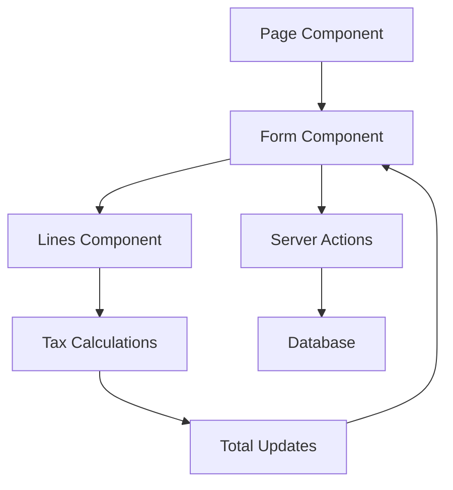

# Documentación Técnica - Mejoras de Compras

## 🔧 Arquitectura de Componentes

### **Jerarquía de Componentes**

```
📁 src/components/purchases/
├── PurchaseInvoiceFormWithTaxes.tsx     # Formulario principal facturas
├── PurchaseInvoiceLinesWithTaxes.tsx    # Gestión líneas facturas
├── PurchaseOrderForm.tsx                # Formulario principal órdenes  
└── PurchaseOrderLinesWithTaxes.tsx      # Gestión líneas órdenes

📁 src/app/dashboard/purchases/
├── invoices/create/page.tsx             # Página creación facturas
├── invoices/[id]/edit/page.tsx          # Página edición facturas
└── orders/create/page.tsx               # Página creación órdenes
```

### **Flujo de Datos**



---

## 💾 Gestión de Estado

### **Estados Principales en Formularios**

```typescript
// Estados de datos del formulario
const [formData, setFormData] = useState<FormData>({
  supplierId: null,
  warehouseId: null,
  lines: [],
  // ... otros campos
});

// Estados de interfaz
const [suppliers, setSuppliers] = useState<Supplier[]>([]);
const [warehouses, setWarehouses] = useState<Warehouse[]>([]);
const [loading, setLoading] = useState(false);

// Estados de búsqueda
const [supplierSearch, setSupplierSearch] = useState('');
const [warehouseSearch, setWarehouseSearch] = useState('');
const [showSupplierDropdown, setShowSupplierDropdown] = useState(false);
const [showWarehouseDropdown, setShowWarehouseDropdown] = useState(false);
```

### **Patrones de Actualización**

```typescript
// 1. Actualización de campos simples
const handleInputChange = (field: keyof FormData, value: any) => {
  setFormData(prev => ({ ...prev, [field]: value }));
};

// 2. Actualización de líneas
const handleLinesChange = (lines: InvoiceLine[]) => {
  setFormData(prev => ({ ...prev, lines }));
};

// 3. Actualización de totales
const handleTotalsChange = (totals: TotalData) => {
  setFormData(prev => ({ 
    ...prev, 
    subtotal: totals.subtotal,
    totalTaxes: totals.totalTaxes,
    total: totals.total 
  }));
};
```

---

## 🔍 Sistema de Búsqueda

### **Implementación de Búsqueda con Filtros**

```typescript
// Hook para filtrar proveedores
useEffect(() => {
  if (!supplierSearch.trim()) {
    setFilteredSuppliers(suppliers);
  } else {
    const filtered = suppliers.filter(supplier => 
      supplier.name?.toLowerCase().includes(supplierSearch.toLowerCase()) ||
      supplier.displayName?.toLowerCase().includes(supplierSearch.toLowerCase()) ||
      supplier.vat?.toLowerCase().includes(supplierSearch.toLowerCase())
    );
    setFilteredSuppliers(filtered);
  }
}, [supplierSearch, suppliers]);
```

### **Componente de Búsqueda Reutilizable**

```typescript
// Estructura del dropdown de búsqueda
<div className="relative">
  <Search className="absolute left-3 top-1/2 transform -translate-y-1/2 text-gray-400 w-4 h-4" />
  <Input
    value={searchTerm}
    onChange={(e) => setSearchTerm(e.target.value)}
    onFocus={() => setShowDropdown(true)}
    placeholder="Buscar..."
    className="pl-10"
  />
  {showDropdown && (
    <div className="absolute z-10 w-full mt-1 bg-white border rounded-md shadow-lg max-h-60 overflow-y-auto">
      {filteredResults.slice(0, 20).map((item) => (
        <div
          key={item.id}
          className="p-3 hover:bg-gray-100 cursor-pointer"
          onClick={() => handleSelect(item)}
        >
          {/* Contenido del item */}
        </div>
      ))}
    </div>
  )}
</div>
```

---

## 💰 Sistema de Cálculo de Impuestos

### **Estructura de Datos de Impuestos**

```typescript
interface InvoiceLineTax {
  id?: number;
  taxType: string;        // 'IVA', 'IVA_ANTICIPADO_HARINA_12', etc.
  taxName: string;        // Nombre para mostrar
  taxRate: number;        // Porcentaje: 19.0, 12.0, etc.
  taxAmount: number;      // Monto calculado
  isRetention: boolean;   // true = se resta, false = se suma
  taxBase: number;        // Base sobre la cual se calcula
}

interface InvoiceLine {
  productId?: number;
  description: string;
  quantity: number;
  unitPrice: number;
  discountAmount: number;
  subtotal: number;       // (quantity * unitPrice) - discountAmount
  taxes: InvoiceLineTax[];
  lineTotal: number;      // subtotal + sum(taxes)
}
```

### **Algoritmo de Cálculo**

```typescript
// 1. Cálculo de subtotal de línea
const calculateLineSubtotal = (line: Partial<InvoiceLine>) => {
  const quantity = line.quantity || 0;
  const unitPrice = line.unitPrice || 0;
  const discountAmount = line.discountAmount || 0;
  return (quantity * unitPrice) - discountAmount;
};

// 2. Agregado de impuesto a línea
const addTaxToLine = (lineIndex: number, taxType: string) => {
  const line = lines[lineIndex];
  const taxConfig = TAX_CONFIG[taxType];
  
  const taxBase = line.subtotal;
  const taxAmount = (taxBase * taxConfig.defaultRate) / 100;
  
  const newTax: InvoiceLineTax = {
    taxType,
    taxName: TAX_TYPES.find(t => t.value === taxType)?.label || taxType,
    taxRate: taxConfig.defaultRate,
    taxAmount,
    isRetention: taxConfig.isRetention,
    taxBase
  };

  // Recalcular total de línea
  const updatedLine = {
    ...line,
    taxes: [...line.taxes, newTax],
    lineTotal: line.subtotal + [...line.taxes, newTax].reduce((sum, tax) => 
      sum + (tax.isRetention ? -tax.taxAmount : tax.taxAmount), 0
    )
  };
};

// 3. Cálculo de totales generales
const calculateTotals = () => {
  const subtotal = lines.reduce((sum, line) => sum + line.subtotal, 0);
  const totalTaxes = lines.reduce((sum, line) => 
    sum + line.taxes.reduce((taxSum, tax) => 
      taxSum + (tax.isRetention ? -tax.taxAmount : tax.taxAmount), 0
    ), 0
  );
  const total = subtotal + totalTaxes;
  
  return { subtotal, totalTaxes, total };
};
```

---

## 🎨 Patrones de UI/UX

### **Loading States**

```typescript
// Loading completo durante carga inicial
if (loadingData) {
  return (
    <div className="flex items-center justify-center p-8">
      <div className="text-center">
        <div className="animate-spin rounded-full h-8 w-8 border-b-2 border-gray-900 mx-auto"></div>
        <p className="mt-2 text-gray-600">Cargando datos...</p>
      </div>
    </div>
  );
}

// Loading en botones durante acciones
<Button type="submit" disabled={loading}>
  {loading ? 'Guardando...' : 'Guardar'}
</Button>
```

### **Estados Vacíos y Feedback**

```typescript
// Resultados de búsqueda vacíos
{filteredResults.length === 0 && (
  <div className="p-3 text-gray-500 text-center">
    No se encontraron resultados
  </div>
)}

// Producto seleccionado
{selectedProduct && (
  <div className="p-3 bg-green-50 border border-green-200 rounded-md">
    <div className="font-medium">{selectedProduct.name}</div>
    <div className="text-sm text-gray-600">SKU: {selectedProduct.sku}</div>
  </div>
)}
```

### **Badges de Estado**

```typescript
// Función para colores de badges de impuestos
const getTaxBadgeColor = (taxType: string) => {
  if (taxType.includes('ANTICIPADO')) return 'bg-orange-100 text-orange-800';
  if (taxType.includes('IVA_C')) return 'bg-blue-100 text-blue-800';
  if (taxType.includes('RETENCION')) return 'bg-red-100 text-red-800';
  return 'bg-green-100 text-green-800';
};

// Uso en componente
<Badge className={`${getTaxBadgeColor(tax.taxType)} text-xs`}>
  {tax.taxName}
  <Button
    onClick={() => removeTax(index)}
    className="h-4 w-4 p-0 ml-1"
  >
    ×
  </Button>
</Badge>
```

---

## 🔗 Integración con Server Actions

### **Server Actions Utilizadas**

```typescript
// Obtener datos para formularios
import { getActiveSuppliers } from '@/actions/suppliers/get';
import { getAllWarehouses } from '@/actions/configuration/warehouse-actions';
import { getProductsForForms } from '@/actions/purchases/common';

// Carga paralela de datos
const loadInitialData = async () => {
  try {
    const [suppliersData, warehousesData, productsData] = await Promise.all([
      getActiveSuppliers(),
      getAllWarehouses(),
      getProductsForForms()
    ]);
    
    setSuppliers(suppliersData || []);
    setWarehouses(warehousesData || []);
    setProducts(productsData || []);
  } catch (error) {
    console.error('Error loading data:', error);
    toast.error('Error cargando datos');
  }
};
```

### **Manejo de Errores**

```typescript
// Pattern para manejo consistente de errores
const handleSubmit = async (e: React.FormEvent) => {
  e.preventDefault();
  setLoading(true);
  
  try {
    await onSubmit(formData);
    toast.success('Guardado exitosamente');
  } catch (error) {
    console.error('Error:', error);
    toast.error('Error al guardar');
  } finally {
    setLoading(false);
  }
};
```

---

## 🧪 Validaciones

### **Validaciones de Formulario**

```typescript
// Validaciones antes de submit
const validateForm = () => {
  if (!formData.supplierInvoiceNumber.trim()) {
    toast.error('El número de factura del proveedor es obligatorio');
    return false;
  }

  if (!formData.supplierId) {
    toast.error('Debe seleccionar un proveedor');
    return false;
  }

  if (!formData.warehouseId) {
    toast.error('Debe seleccionar una bodega');
    return false;
  }

  if (formData.lines.length === 0) {
    toast.error('Debe agregar al menos una línea');
    return false;
  }

  return true;
};
```

### **Validaciones de Productos**

```typescript
// Validación al agregar línea
const addNewLine = () => {
  if (!newLine.productId || !newLine.description.trim()) {
    toast.error('Debe seleccionar un producto de la lista');
    return;
  }

  if (newLine.quantity <= 0) {
    toast.error('La cantidad debe ser mayor a 0');
    return;
  }

  // Proceder con la adición...
};
```

---

## 🎯 Optimizaciones de Performance

### **Límites en Búsquedas**

```typescript
// Limitar resultados para evitar lag en UI
{filteredResults.slice(0, 20).map((item) => (
  <SearchResultItem key={item.id} item={item} />
))}

// Debounce en búsquedas (si es necesario)
const debouncedSearch = useDebounce(searchTerm, 300);
```

### **Memoización de Cálculos**

```typescript
// Memoizar cálculos pesados
const totalCalculations = useMemo(() => {
  return calculateTotals();
}, [lines]);

// Memoizar componentes pesados
const TaxBadges = React.memo(({ taxes, onRemove }) => {
  return taxes.map((tax, index) => (
    <TaxBadge key={index} tax={tax} onRemove={() => onRemove(index)} />
  ));
});
```

---

## 🔧 Configuración y Constantes

### **Configuración de Impuestos**

```typescript
// src/constants/supplier.ts
export const TAX_CONFIG = {
  'IVA_19': { 
    defaultRate: 19.0, 
    category: null, 
    isRetention: false 
  },
  'IVA_ANTICIPADO_HARINA_12': { 
    defaultRate: 12.0, 
    category: 'Harinas', 
    isRetention: false  // CORREGIDO: era true
  },
  // ... más configuraciones
} as const;

export const TAX_TYPES = [
  { value: 'IVA_19', label: 'IVA 19% Compra' },
  { value: 'IVA_ANTICIPADO_HARINA_12', label: 'IVA ANTICIPADO HARINA 12%' },
  // ... más tipos
] as const;
```

### **Tipos TypeScript**

```typescript
// Interfaces principales
interface InvoiceLineTax {
  id?: number;
  taxType: string;
  taxName: string;
  taxRate: number;
  taxAmount: number;
  isRetention: boolean;
  taxBase: number;
}

interface InvoiceLine {
  id?: number;
  productId?: number;
  description: string;
  productCode?: string;
  quantity: number;
  unitPrice: number;
  discountPercent: number;
  discountAmount: number;
  subtotal: number;
  taxes: InvoiceLineTax[];
  lineTotal: number;
}

interface PurchaseInvoiceFormData {
  invoiceNumber: string;
  supplierInvoiceNumber: string;
  supplierId: number | null;
  warehouseId: number | null;
  // ... otros campos
  lines: InvoiceLine[];
}
```

---

## 🚀 Mejores Prácticas Implementadas

### **1. Separación de Responsabilidades**
- **Form Components**: Gestión de estado del formulario
- **Lines Components**: Gestión específica de líneas y productos
- **Server Actions**: Lógica de backend
- **Constants**: Configuraciones centralizadas

### **2. Manejo Consistente de Estados**
- Estados locales para UI (dropdowns, loading)
- Props para comunicación entre componentes
- Callbacks para actualización de padres

### **3. Accesibilidad**
- Labels apropiados para screen readers
- Focus management en dropdowns
- Keyboard navigation support

### **4. Error Handling**
- Try-catch en todas las operaciones async
- Toast notifications para feedback
- Estados de error específicos

### **5. Performance**
- Límites en resultados de búsqueda
- Memoización donde corresponde
- Loading states para operaciones lentas

---

## 📋 Checklist de Implementación

### **Para Nuevos Componentes de Compras**

- [ ] ✅ Implementar búsqueda con filtros
- [ ] ✅ Manejar estados de loading
- [ ] ✅ Agregar validaciones apropiadas
- [ ] ✅ Usar tipos TypeScript estrictos
- [ ] ✅ Implementar manejo de errores
- [ ] ✅ Agregar feedback visual (toasts)
- [ ] ✅ Responsive design
- [ ] ✅ Accesibilidad básica
- [ ] ✅ Consistencia con patrones existentes

### **Para Cálculos de Impuestos**

- [ ] ✅ Verificar configuración en `TAX_CONFIG`
- [ ] ✅ Validar que `isRetention` sea correcto
- [ ] ✅ Probar cálculos con casos edge
- [ ] ✅ Manejar múltiples impuestos por línea
- [ ] ✅ Recalcular automáticamente en cambios

---

*Documentación técnica actualizada: Enero 2025*  
*Versión: 2.0* 