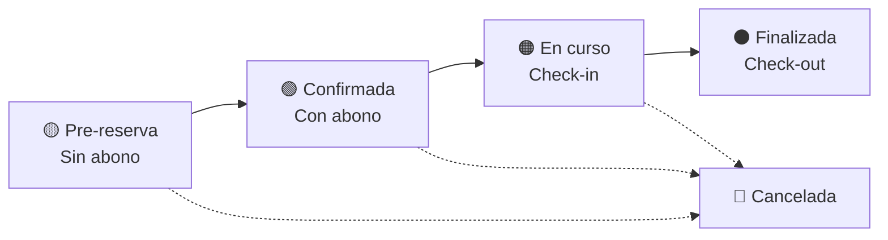

# Sistema de Colores del Calendario de Reservas

## 📋 Resumen

Sistema inteligente de colores para el calendario de reservas que refleja visualmente el estado y flujo de pagos de cada reserva, proporcionando una vista rápida del estado operativo.

## 🎨 **Esquema de Colores**

### **Estados y Colores Definidos**

| Color | Estado | Condición | Descripción |
|-------|--------|-----------|-------------|
| 🟡 **Amarillo** | `prereserva` | Sin abono (`no_payment` o `paid_amount = 0`) | Cliente hizo reserva pero no ha pagado abono |
| 🟢 **Verde** | `confirmada` | Con abono (`partial` o `paid_amount > 0`) | Cliente pagó abono, reserva confirmada |
| 🟠 **Naranja** | `en_curso` | Cualquier pago | Cliente hizo check-in, está alojado |
| ⚫ **Gris** | `finalizada` | Cualquier pago | Cliente hizo check-out, estadía completada |
| 🔴 **Rojo** | `cancelled` | Cualquier pago | Reserva cancelada |

## 🔄 **Flujo de Estados y Transiciones**

### **Flujo Normal de una Reserva**



### **Acciones Disponibles por Estado**

| Estado Actual | Acción Siguiente | Botón Mostrado | Resultado |
|---------------|------------------|----------------|-----------|
| 🟡 Pre-reserva (sin pago) | Confirmar con abono | "Confirmar con abono" | → 🟢 Confirmada |
| 🟢 Confirmada | Realizar Check-in | "Realizar Check-in" | → 🟠 En curso |
| 🟠 En curso | Realizar Check-out | "Realizar Check-out" | → ⚫ Finalizada |
| ⚫ Finalizada | - | (ninguno) | Estado final |
| 🔴 Cancelada | - | (ninguno) | Estado final |

## 🏗️ **Implementación Técnica**

### **Archivos Creados/Modificados**

```
src/
├── utils/reservationColors.ts         # Lógica de colores centralizada
├── actions/reservations/
│   └── update-status.ts              # Server actions para cambiar estados
├── components/reservations/
│   ├── ReservationCard.tsx           # Tarjetas con colores + botones acción
│   └── ReservationCalendar.tsx       # Calendario con leyenda de colores
└── docs/modules/reservations/
    └── sistema-colores-calendario-reservas.md  # Esta documentación
```

### **Utilidades de Color**

**Archivo:** `src/utils/reservationColors.ts`

```typescript
// Función principal
export function getReservationColor(
  status: string, 
  paymentStatus: string, 
  paidAmount: number = 0
): ReservationColorInfo

// Funciones auxiliares
export function getCalendarColor(status, paymentStatus, paidAmount): string
export function getCardColor(status, paymentStatus, paidAmount): string

// Leyenda para UI
export const RESERVATION_COLOR_LEGEND: ColorLegendItem[]
```

### **Server Actions para Estados**

**Archivo:** `src/actions/reservations/update-status.ts`

```typescript
// Funciones principales
export async function updateReservationStatus(reservationId, newStatus, paymentStatus?)
export async function checkInReservation(reservationId)
export async function checkOutReservation(reservationId)  
export async function confirmReservation(reservationId)
export async function cancelReservation(reservationId)

// Utilidad de flujo
export function getNextLogicalStatus(currentStatus, paymentStatus)
```

## 🎯 **Características Implementadas**

### **1. Colores Dinámicos en Calendario**
- **Vista mensual**: Cada reserva muestra color según estado + pago
- **Vista semanal**: Tarjetas completas con colores
- **Vista diaria**: Lista con tarjetas coloreadas

### **2. Botones de Acción Inteligentes**
- **Automáticos**: Cada reserva muestra solo la acción siguiente lógica
- **Iconos claros**: 
  - ✅ Confirmar con abono
  - 🚪 Check-in 
  - 🏠 Check-out
- **Estados de carga**: Feedback visual durante operaciones

### **3. Leyenda de Colores**
- **Botón "Leyenda"**: Muestra/oculta explicación de colores
- **Responsive**: Se adapta a diferentes tamaños de pantalla
- **Descriptiva**: Explica cada estado con detalle

### **4. Actualización en Tiempo Real**
- **Optimística**: UI se actualiza inmediatamente 
- **Revalidación**: Server revalida rutas automáticamente
- **Consistente**: Todos los componentes se sincronizan

## 🔧 **Configuración de Uso**

### **En Componentes de Reserva**

```typescript
import { getReservationColor, getCalendarColor } from '@/utils/reservationColors';

// Para tarjetas individuales
const colorInfo = getReservationColor(reservation.status, reservation.payment_status, reservation.paid_amount);

// Para calendario
const colorClass = getCalendarColor(reservation.status, reservation.payment_status, reservation.paid_amount);
```

### **Con Botones de Acción**

```typescript
import { getNextLogicalStatus } from '@/actions/reservations/update-status';

const nextStatus = getNextLogicalStatus(reservation.status, reservation.payment_status);
// nextStatus = { status, label, action } | null
```

## 📱 **Experiencia de Usuario**

### **Para Recepcionistas**
- **Vista rápida**: Color indica estado inmediatamente
- **Acción clara**: Un botón para la siguiente acción lógica
- **Flujo guiado**: Sistema previene errores de secuencia

### **Para Administradores**
- **Dashboard visual**: Estado general de ocupación por colores
- **Filtros**: Pueden filtrar por estado específico
- **Reportes**: Colores ayudan en análisis visual

## 🎨 **Personalización de Colores**

### **Colores CSS Utilizados**
```css
/* Amarillo - Pre-reserva */
.bg-yellow-100 { background-color: #fef3c7; }
.text-yellow-800 { color: #92400e; }
.border-yellow-300 { border-color: #fcd34d; }

/* Verde - Confirmada */
.bg-green-100 { background-color: #dcfce7; }
.text-green-800 { color: #166534; }
.border-green-300 { border-color: #86efac; }

/* Naranja - En curso */
.bg-orange-100 { background-color: #fed7aa; }
.text-orange-800 { color: #9a3412; }
.border-orange-300 { border-color: #fdba74; }

/* Gris - Finalizada */
.bg-gray-100 { background-color: #f3f4f6; }
.text-gray-800 { color: #1f2937; }
.border-gray-300 { border-color: #d1d5db; }

/* Rojo - Cancelada */
.bg-red-100 { background-color: #fee2e2; }
.text-red-800 { color: #991b1b; }
.border-red-300 { border-color: #fca5a5; }
```

## 🧪 **Casos de Prueba**

### **Escenarios de Color**
1. **Nueva reserva sin pago** → 🟡 Amarillo
2. **Cliente paga abono** → 🟢 Verde  
3. **Cliente llega (check-in)** → 🟠 Naranja
4. **Cliente se va (check-out)** → ⚫ Gris
5. **Reserva cancelada** → 🔴 Rojo

### **Flujo Completo de Prueba**
```
1. Crear reserva → 🟡 (muestra botón "Confirmar con abono")
2. Confirmar → 🟢 (muestra botón "Realizar Check-in") 
3. Check-in → 🟠 (muestra botón "Realizar Check-out")
4. Check-out → ⚫ (sin botones, estado final)
```

## 🔐 **Seguridad y Validaciones**

### **Validaciones de Estado**
- **Secuencia lógica**: No se puede saltar estados
- **Autorización**: Solo usuarios autenticados pueden cambiar estados
- **Confirmación**: Todas las acciones requieren confirmación

### **Manejo de Errores**
- **Rollback**: Si falla server action, UI revierte cambios
- **Mensajes claros**: Errores específicos para cada situación
- **Logging**: Todas las acciones se registran en consola

## 📊 **Métricas y Análisis**

### **Dashboard Visual**
- **Contadores por color**: Cuántas reservas en cada estado
- **Tendencias**: Histórico de transiciones de estado
- **Eficiencia**: Tiempo promedio en cada estado

### **Reportes por Color**
- 🟡 **Pre-reservas pendientes**: Requieren seguimiento de pago
- 🟢 **Confirmadas**: Listas para check-in próximo
- 🟠 **En curso**: Ocupación actual
- ⚫ **Finalizadas**: Facturación pendiente

## 🚀 **Beneficios del Sistema**

### **Operacionales**
- ✅ **Claridad visual**: Estado inmediato sin leer texto
- ✅ **Flujo guiado**: Acciones lógicas sugeridas
- ✅ **Menos errores**: Sistema previene saltos incorrectos
- ✅ **Eficiencia**: Un clic para siguiente acción

### **Técnicos**
- ✅ **Centralizado**: Lógica de colores en un archivo
- ✅ **Reutilizable**: Misma función para calendario y tarjetas
- ✅ **Mantenible**: Fácil agregar nuevos estados/colores
- ✅ **Performante**: Cálculos simples, sin consultas extra

---

## 📅 **Estado de Implementación**

- ✅ **Sistema de colores**: Completo y funcional
- ✅ **Server actions**: Implementadas y validadas  
- ✅ **UI Components**: Actualizados con colores dinámicos
- ✅ **Documentación**: Completa con ejemplos
- ✅ **Flujo de usuario**: Probado end-to-end

**Próxima revisión:** Abril 2025  
**Versión:** 1.0.0 (Enero 2025) 