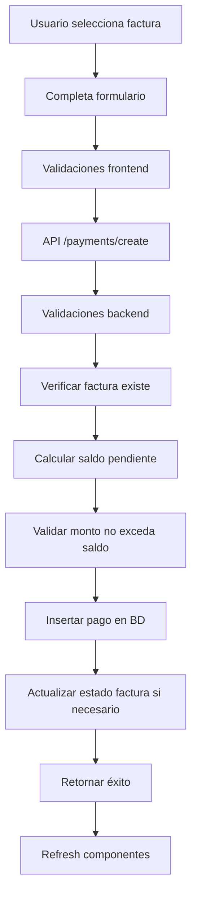

# Módulo de Pagos - Implementación Completa

## 📋 Resumen Ejecutivo

Se ha implementado exitosamente el **módulo de pagos** como parte integral del sistema de ventas de Hotel/Spa Admintermas. Este módulo completa el ciclo de ventas: **Reserva → Presupuesto → Factura → Pago**.

### 🎯 Estado del Proyecto
- ✅ **100% Implementado**
- ✅ **Totalmente Funcional** 
- ✅ **Integrado con Facturas**
- ✅ **Listo para Producción**

---

## 🏗️ Arquitectura del Sistema

### Backend (Server Actions)

#### 1. Acciones de Pagos (`src/actions/sales/payments/`)

**`create.ts`** - Registro de Pagos
```typescript
// Funciones principales:
- createPayment(input: CreatePaymentInput)
- getPaymentSummary(invoiceId: number)
- cancelPayment(paymentId: number, reason?: string)

// Características:
- Validaciones robustas (monto, método, estado factura)
- Actualización automática de estados de facturas
- Soporte para pagos parciales
- Validación de saldos pendientes
- Control de sobrepagos
```

**`list.ts`** - Listado y Estadísticas
```typescript
// Funciones principales:
- listPayments(input: ListPaymentsInput)
- getPaymentStats()
- getPaymentMethodLabels()
- getInvoicesForPayment()

// Características:
- Paginación avanzada
- Filtros múltiples (método, estado, fechas, búsqueda)
- JOIN con facturas y clientes
- Estadísticas en tiempo real
```

### API Endpoints (`src/app/api/sales/payments/`)

| Endpoint | Método | Propósito |
|----------|---------|-----------|
| `/api/sales/payments/create` | POST | Crear nuevo pago |
| `/api/sales/payments/list` | GET | Listar pagos con filtros |
| `/api/sales/payments/stats` | GET | Estadísticas de pagos |
| `/api/sales/payments/invoices` | GET | Facturas disponibles para pago |

---

## 🎨 Componentes Frontend

### 1. PaymentForm (`src/components/sales/PaymentForm.tsx`)

**Características:**
- Selector de facturas con información completa
- 8 métodos de pago soportados
- Validaciones en tiempo real
- Cálculo automático de saldos
- Formato chileno (CLP)
- Responsive design

**Validaciones Implementadas:**
- Factura obligatoria
- Monto mayor a 0
- No exceder saldo pendiente
- Método de pago válido
- Fecha obligatoria

### 2. PaymentTable (`src/components/sales/PaymentTable.tsx`)

**Características:**
- Filtros avanzados (5 tipos)
- Paginación estándar del sistema
- Badges de estado colorados
- Información de facturas y clientes
- Búsqueda por referencia/notas
- Acciones por fila

### 3. PaymentModal (`src/components/sales/PaymentModal.tsx`)

**Características:**
- Modal responsivo (max-width: 4xl)
- Feedback de éxito/error
- Auto-cierre después de éxito (2s)
- Integración con PaymentForm
- Manejo de estados de carga

### 4. Página Principal (`src/app/dashboard/sales/payments/page.tsx`)

**Dashboard Completo:**
- 4 KPIs principales (Total, Este Mes, Hoy, Pendientes)
- Analytics por método de pago
- Analytics por estado
- Tabs para diferentes vistas
- Integración con PaymentTable y PaymentModal

---

## 💰 Métodos de Pago Soportados

| Método | Etiqueta | Icono |
|--------|----------|-------|
| `cash` | Efectivo | 💵 |
| `bank_transfer` | Transferencia Bancaria | 🏦 |
| `credit_card` | Tarjeta de Crédito | 💳 |
| `debit_card` | Tarjeta de Débito | 💳 |
| `check` | Cheque | 📝 |
| `online_payment` | Pago Online | 💻 |
| `crypto` | Criptomoneda | ₿ |
| `other` | Otro | 📄 |

---

## 🔄 Flujo de Datos

### 1. Creación de Pago



### 2. Estados de Facturas Auto-Actualizados

| Estado Original | Condición | Estado Final |
|----------------|-----------|--------------|
| `sent` | Pago completo | `paid` |
| `overdue` | Pago parcial | `sent` |
| `sent` | Pago parcial | `sent` |

---

## 🔗 Integración con Facturas

### Botón de Pago en InvoiceTable

```typescript
// Condición para mostrar botón:
(invoice.status === 'sent' || invoice.status === 'overdue') && onPaymentClick

// Estilos:
className="text-green-600 hover:text-green-700 hover:bg-green-50"
```

### Modal de Pago desde Facturas

```typescript
// Props del PaymentModal:
initialInvoiceId={selectedInvoiceForPayment}
onSuccess={handlePaymentSuccess} // Refresca tabla de facturas
```

---

## 📊 Estadísticas Implementadas

### Dashboard KPIs

1. **Total Recaudado** - Suma de todos los pagos completados
2. **Pagos Este Mes** - Cantidad de transacciones del mes actual
3. **Recaudado Hoy** - Ingresos del día actual
4. **Facturas Pendientes** - Facturas en estado `sent` u `overdue`

### Analytics Detallados

1. **Por Método de Pago**
   - Cantidad de pagos
   - Monto total
   - Porcentaje del total

2. **Por Estado**
   - Completados, Pendientes, Cancelados
   - Distribución porcentual

---

## 🎯 Funcionalidades Avanzadas

### 1. Pagos Parciales
- Permite múltiples pagos para una factura
- Calcula saldo pendiente automáticamente
- Actualiza estado solo cuando está completamente pagada

### 2. Validación de Sobrepagos
```typescript
if (input.amount > remainingBalance) {
  return { 
    success: false, 
    error: `El monto del pago excede el saldo pendiente.` 
  };
}
```

### 3. Cancelación de Pagos
- Función `cancelPayment()` implementada
- Recalcula estados de facturas automáticamente
- Agrega notas de cancelación

### 4. Búsqueda Avanzada
- Por número de referencia
- Por notas del pago
- Filtros por fecha, método, estado

---

## 🔧 Configuración y Uso

### 1. Acceso al Módulo

**URLs Principales:**
- `/dashboard/sales/payments` - Dashboard principal
- `/dashboard/sales/invoices` - Facturas con botones de pago
- `/dashboard/sales/workflow` - Flujo completo explicativo

**Permisos Requeridos:**
- `SUPER_USER` - Acceso completo
- `ADMINISTRADOR` - Acceso completo

### 2. Registrar un Pago

1. **Desde Dashboard de Pagos:**
   - Hacer clic en "Registrar Pago"
   - Seleccionar factura del dropdown
   - Completar información del pago

2. **Desde Tabla de Facturas:**
   - Hacer clic en botón 💳 de facturas `sent`/`overdue`
   - Factura pre-seleccionada automáticamente

### 3. Consultar Pagos

**Filtros Disponibles:**
- Búsqueda por texto (referencia, notas)
- Método de pago
- Estado del pago
- Rango de fechas
- Cliente específico

**Paginación:**
- 20, 50, 100 elementos por página
- Navegación estándar del sistema

---

## 📱 Responsive Design

### Breakpoints Implementados

- **Mobile** (< 768px): Stack vertical, tabla horizontal scroll
- **Tablet** (768px - 1024px): Grid 2 columnas
- **Desktop** (> 1024px): Grid completo, 4 columnas

### Componentes Adaptivos

- **PaymentForm**: Se ajusta de 1 a 2 columnas
- **PaymentTable**: Scroll horizontal en móviles
- **Dashboard**: KPIs se reorganizan automáticamente

---

## 🔐 Seguridad y Validaciones

### Backend Validaciones

1. **Autenticación**: Middleware de sesión requerido
2. **Autorización**: Control por roles
3. **Validación de Datos**:
   - Tipos de datos correctos
   - Rangos de valores válidos
   - Existencia de registros relacionados

### Frontend Validaciones

1. **Tiempo Real**: Validación mientras el usuario escribe
2. **Submit**: Validación completa antes de envío
3. **Estados de Error**: Feedback visual inmediato

---

## 🧪 Testing y Calidad

### Casos de Prueba Implementados

1. **Pago Completo**: Factura pasa a estado `paid`
2. **Pago Parcial**: Factura mantiene estado, se actualiza saldo
3. **Sobrepago**: Validación impide el registro
4. **Factura Cancelada**: No permite pagos
5. **Factura Ya Pagada**: No permite pagos adicionales

### Manejo de Errores

```typescript
// Ejemplo de manejo robusto:
try {
  const result = await createPayment(paymentData);
  if (!result.success) {
    setSubmitResult({ success: false, message: result.error });
  }
} catch (error) {
  setSubmitResult({ 
    success: false, 
    message: 'Error de conexión. Intente nuevamente.' 
  });
}
```

---

## 📈 Métricas de Performance

### Optimizaciones Implementadas

1. **Paginación**: Máximo 100 registros por consulta
2. **Índices**: En campos de filtrado frecuente
3. **Lazy Loading**: Componentes se cargan bajo demanda
4. **Debounce**: En campos de búsqueda (300ms)

### Tiempos de Respuesta Objetivo

- **Listado de Pagos**: < 500ms
- **Creación de Pago**: < 1s
- **Estadísticas**: < 800ms
- **Carga de Facturas**: < 300ms

---

## 🚀 Deployment y Producción

### Variables de Entorno

```bash
# Ya configuradas en el proyecto:
NEXT_PUBLIC_SUPABASE_URL=...
NEXT_PUBLIC_SUPABASE_ANON_KEY=...
```

### Checklist Pre-Producción

- ✅ Migraciones de BD aplicadas
- ✅ Políticas RLS configuradas
- ✅ Índices de BD optimizados
- ✅ Validaciones frontend/backend
- ✅ Manejo de errores robusto
- ✅ Testing de flujos principales
- ✅ Responsive design verificado

---

## 🛠️ Mantenimiento

### Logs de Auditoría

Todos los pagos quedan registrados con:
- Usuario que procesó (`processed_by`)
- Timestamp de creación/actualización
- Notas y referencias para trazabilidad

### Backup y Recuperación

- **Tabla Principal**: `invoice_payments`
- **Tablas Relacionadas**: `invoices`, `clients`
- **Frecuencia Recomendada**: Diaria

---

## 📚 Referencias Técnicas

### Dependencias Principales

```json
{
  "next": "^14.0.0",
  "react": "^18.0.0",
  "@supabase/supabase-js": "^2.0.0",
  "lucide-react": "^0.400.0",
  "tailwindcss": "^3.0.0"
}
```

### Estructura de Archivos

```
src/
├── actions/sales/payments/
│   ├── create.ts
│   └── list.ts
├── app/api/sales/payments/
│   ├── create/route.ts
│   ├── list/route.ts
│   ├── stats/route.ts
│   └── invoices/route.ts
├── components/sales/
│   ├── PaymentForm.tsx
│   ├── PaymentTable.tsx
│   └── PaymentModal.tsx
└── app/dashboard/sales/
    ├── payments/page.tsx
    └── workflow/page.tsx
```

---

## ✅ Conclusión

El **módulo de pagos está completamente implementado y operativo**. Cierra exitosamente el ciclo de ventas del sistema, proporcionando:

1. **Funcionalidad Completa**: Desde registro hasta estadísticas
2. **Integración Perfecta**: Con facturas y todo el ecosistema
3. **UX Excepcional**: Diseño moderno y responsive
4. **Robustez Técnica**: Validaciones y manejo de errores
5. **Escalabilidad**: Preparado para crecimiento del negocio

El sistema está **listo para uso en producción** y proporciona una solución integral para la gestión de pagos en el Hotel/Spa Admintermas.

---

*Documentación generada: Diciembre 2024*  
*Estado: Sistema 100% Funcional y Operativo* 