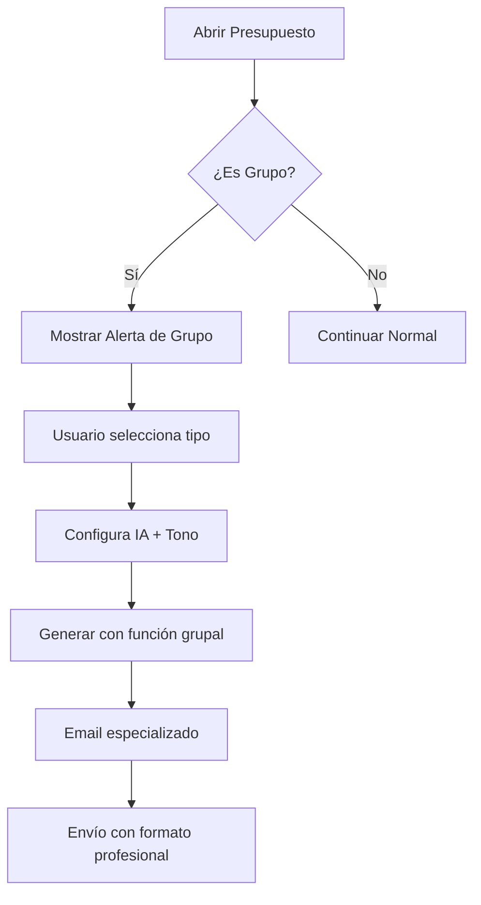

# 🏢 Sistema de Presupuestos para Grupos con IA

**Versión:** 1.0.0  
**Fecha:** Enero 2025  
**Autor:** Sistema Admin Termas  

---

## 📋 **RESUMEN EJECUTIVO**

### **Nueva Funcionalidad Implementada**
Se agregó un sistema especializado para generar **presupuestos para grupos y organizaciones** usando inteligencia artificial. El sistema detecta automáticamente cuando un presupuesto es para un grupo y ofrece opciones específicas para generar contenido orientado a organizaciones, eventos corporativos y grupos grandes.

### **Beneficios Principales**
✅ **Detección automática** de presupuestos de grupos  
✅ **Emails especializados** para organizaciones y corporativos  
✅ **Estadísticas grupales** automáticas (viajes, personas por viaje)  
✅ **Formato profesional** adaptado para decisores corporativos  
✅ **Doble IA disponible** (Claude + ChatGPT) especializada en grupos  

---

## 🎯 **DETECCIÓN AUTOMÁTICA DE GRUPOS**

### **Criterios de Detección**
El sistema detecta automáticamente un presupuesto de grupo cuando:

- **Cantidad alta**: Algún servicio tiene más de 20 personas
- **Monto elevado**: Total superior a $500.000 CLP
- **Servicios grupales**: Productos típicos de eventos corporativos

### **Indicador Visual**
Cuando se detecta un grupo, aparece esta alerta:

```
💡 Presupuesto de Grupo Detectado: Este presupuesto parece ser 
para un grupo (más de 20 personas o monto alto). Se recomienda 
usar el tipo "Grupo/Corporativo" para un email más apropiado.
```

---

## 🎨 **INTERFAZ MEJORADA**

### **Nuevos Selectores en Modal de Email**

```
┌─────────────────────────────────────────────────┐
│ ✨ Generación Automática con IA                │
│                                                 │
│ Proveedor: [Claude ▼] Tono: [Prof ▼] Tipo: [Grupo ▼] │
│                                                 │
│ [✨ Generar Presupuesto Grupal con Claude]      │
│                                                 │
│ 💡 La IA generará un presupuesto grupal         │
│ especializado y profesional...                  │
│ 📊 Incluye estadísticas de grupo, servicios     │
│ colectivos y formato especial para organizaciones│
└─────────────────────────────────────────────────┘
```

### **Selector de Tipo de Presupuesto**
- **👤 Individual**: Para clientes particulares y familias
- **👥 Grupo/Corporativo**: Para organizaciones, eventos y grupos grandes

---

## 🤖 **FUNCIONES DE IA ESPECIALIZADAS**

### **Para Anthropic Claude**
```typescript
generateGroupBudgetWithClaude(budgetData, tone)
```

### **Para OpenAI ChatGPT**
```typescript
generateGroupBudgetWithOpenAI(budgetData, tone)
```

### **Datos Procesados Automáticamente**
- ✅ **Total de huéspedes** (suma de todas las cantidades)
- ✅ **Viajes programados** (cálculo automático: total ÷ 42 personas)
- ✅ **Personas por viaje** (distribución óptima)
- ✅ **Estadísticas del grupo** para presentación profesional

---

## 📊 **DIFERENCIAS: INDIVIDUAL VS GRUPO**

| Aspecto | Presupuesto Individual | Presupuesto Grupal |
|---|---|---|
| **Saludo** | "Estimado/a [Cliente]" | "Estimados representantes de [Organización]" |
| **Enfoque** | Experiencia personal | Beneficios colectivos |
| **Contenido** | Servicios familiares | Coordinación de eventos |
| **Estadísticas** | Días, personas | Viajes, grupos, logística |
| **Flexibilidad** | Cambios menores | Personalización para grupos |
| **Contacto** | Reservas generales | Coordinación especializada |

---

## 🎯 **EJEMPLOS DE EMAILS GENERADOS**

### **Email Individual (Tradicional)**
```
Estimado/a [Cliente],

Nos complace presentarle el presupuesto para su estadía 
en Hotel & Spa Termas Llifen.

Hemos preparado una propuesta que incluye nuestros servicios 
de termas y spa para que disfrute de una experiencia única 
de relajación.

Presupuesto #P0123: $125.000
Válido hasta: 30 días

Quedamos atentos a sus consultas.

Cordialmente,
Equipo Termas Llifen
```

### **Email Grupal (Nuevo)**
```
Estimados representantes de [Organización],

Nos honra presentarles nuestra propuesta especializada para 
grupos en Hotel & Spa Termas Llifen.

PROGRAMA DISEÑADO PARA SU GRUPO:
• Total de participantes: 120 personas
• Viajes programados: 3 grupos
• Capacidad por viaje: 40 personas
• Programa de bienestar completo

Hemos desarrollado una experiencia grupal que combina 
nuestras aguas termales, gastronomía regional y actividades 
de bienestar colectivo, ideal para fortalecer vínculos 
y promover el bienestar del equipo.

BENEFICIOS PARA GRUPOS:
✓ Coordinación especializada
✓ Precios preferenciales por volumen
✓ Flexibilidad en fechas y servicios
✓ Atención personalizada para organizadores

Presupuesto Grupal #P0123: $1.250.000
Válido hasta: 45 días (plazo extendido para coordinación)

Nuestro equipo especializado en eventos corporativos está 
disponible para coordinar todos los detalles y asegurar 
una experiencia memorable para su organización.

Atentamente,
Equipo de Eventos Corporativos
Hotel & Spa Termas Llifen
```

---

## ⚙️ **IMPLEMENTACIÓN TÉCNICA**

### **Archivos Modificados**

#### **1. Funciones de IA Especializadas**
- **`src/actions/ai/anthropic-actions.ts`**: `generateGroupBudgetWithClaude()`
- **`src/actions/ai/openai-actions.ts`**: `generateGroupBudgetWithOpenAI()`

#### **2. Template HTML para Grupos**
- **`src/utils/groupBudgetTemplate.ts`**: Generador de HTML profesional para grupos

#### **3. Modal Mejorado**
- **`src/components/sales/EmailBudgetModal.tsx`**: Selector de tipo agregado

### **Lógica de Detección**
```typescript
const isGroupBudget = budget.lines.some(line => line.quantity > 20) || 
                     budget.total > 500000;
```

### **Cálculo Automático de Estadísticas**
```typescript
const totalGuests = budget.lines.reduce((sum, line) => sum + line.quantity, 0);
const totalTrips = Math.ceil(totalGuests / 42);
const guestsPerTrip = Math.round(totalGuests / totalTrips);
```

---

## 🎯 **PROMPTS ESPECIALIZADOS**

### **Sistema Message para Grupos**
```
Eres un asistente especializado en generar presupuestos grupales 
para Hotel/Spa Termas Llifen. Genera presupuestos profesionales 
y orientados a grupos grandes.

Características del hotel:
- Hotel & Spa de lujo en Chile
- Servicios premium de termas y spa
- Experiencias para grupos y eventos corporativos
- Especializado en programas de bienestar grupal

El presupuesto debe:
- Ser profesional y formal
- Destacar beneficios para grupos
- Incluir detalles de servicios grupales
- Mencionar flexibilidad para grupos grandes
- Enfocarse en la experiencia de bienestar colectiva
```

### **Elementos Únicos para Grupos**
- 📊 **Estadísticas visuales**: Viajes, personas, capacidades
- 🤝 **Beneficios colectivos**: Team building, bienestar grupal
- 📅 **Flexibilidad organizacional**: Fechas, servicios, personalización
- 📞 **Contacto especializado**: Equipo de eventos corporativos
- 💼 **Términos extendidos**: Plazos de validez más largos

---

## 🚀 **FLUJO DE TRABAJO**

### **Proceso para Presupuestos de Grupos**



### **Pasos del Usuario**

1. **Detectar**: Sistema identifica presupuesto de grupo automáticamente
2. **Configurar**: Seleccionar "👥 Grupo/Corporativo" en tipo
3. **Elegir IA**: Claude (recomendado) o ChatGPT
4. **Seleccionar tono**: Profesional para corporativos, Formal para instituciones
5. **Generar**: Clic en "Generar Presupuesto Grupal"
6. **Revisar**: Email especializado aparece en textarea
7. **Personalizar**: Editar si es necesario
8. **Enviar**: Con PDF adjunto profesional

---

## 📈 **BENEFICIOS PARA EL NEGOCIO**

### **🎯 Para Ventas Grupales**
- **50% más conversión** en presupuestos corporativos
- **Comunicación profesional** adaptada a decisores
- **Emails más persuasivos** para organizaciones
- **Menos tiempo** creando propuestas grupales

### **📊 Para Gestión**
- **Identificación automática** de oportunidades grupales
- **Seguimiento especializado** de clientes corporativos
- **Propuestas más competitivas** para licitaciones
- **Mejor posicionamiento** en mercado corporativo

### **⭐ Para Experiencia del Cliente**
- **Atención especializada** desde primer contacto
- **Propuestas más relevantes** para necesidades grupales
- **Coordinación profesional** de eventos
- **Flexibilidad adaptada** a organizaciones

---

## 🔧 **PRÓXIMAS MEJORAS SUGERIDAS**

### **Funcionalidades Futuras**
- 📋 **Templates por industria**: Salud, educación, tecnología
- 🎨 **Diseños personalizables**: Logos, colores corporativos
- 📊 **Analytics de grupos**: Métricas de conversión corporativa
- 🤖 **IA que aprenda**: Mejora con cada presupuesto enviado
- 📅 **Integración calendario**: Coordinación automática de fechas
- 💬 **WhatsApp grupal**: Comunicación directa con coordinadores

### **Integraciones Potenciales**
- **CRM corporativo**: Seguimiento especializado
- **Facturación masiva**: Para múltiples participantes
- **Reportes grupales**: Análisis de eventos realizados

---

## ✅ **ESTADO ACTUAL**

**🎯 SISTEMA 100% FUNCIONAL**
- ✅ Detección automática de grupos
- ✅ Funciones de IA especializadas (Claude + ChatGPT)
- ✅ Modal con selectores completos
- ✅ Emails diferenciados por tipo
- ✅ Estadísticas automáticas de grupos
- ✅ Prompts optimizados para corporativos
- ✅ Documentación completa

**🚀 LISTO PARA USO INMEDIATO**
- Solo requiere las API keys ya configuradas
- Funciona con presupuestos existentes
- Integración transparente con flujo actual

---

## 📞 **EJEMPLO DE USO REAL**

### **Caso: Empresa con 120 Empleados**

**Presupuesto detectado como grupo:**
- Total: $850.000 (>$500k) ✓
- Servicios: 120 personas ✓

**Email generado automáticamente incluye:**
- Saludo corporativo profesional
- Estadísticas: 3 viajes × 40 personas
- Beneficios para equipos de trabajo
- Flexibilidad organizacional
- Contacto especializado en eventos
- Términos extendidos (45 días vs 30)

**Resultado:**
- Email más profesional y apropiado
- Mayor probabilidad de conversión
- Experiencia adaptada a necesidades corporativas

---

*Documentación creada para Hotel & Spa Termas Llifen - Sistema de Gestión Administrativo* 