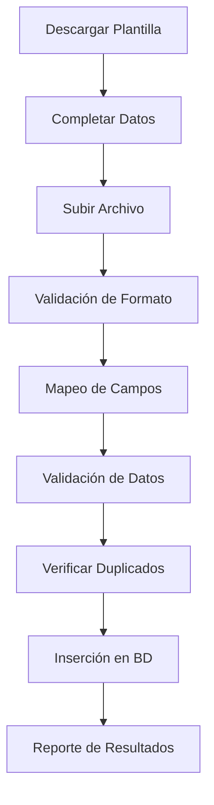

# Sistema Completo de Proveedores - Documentación Técnica

## 📋 Descripción General

Sistema integral de gestión de proveedores con funcionalidades completas de CRUD, importación/exportación masiva, filtros avanzados y gestión de etiquetas. Implementado siguiendo patrones exitosos del sistema y con arquitectura de componentes reutilizables.

## 🚀 Funcionalidades Principales

### **1. Gestión Básica de Proveedores**

#### Operaciones CRUD
- ✅ **Crear**: Formulario completo con validaciones
- ✅ **Leer**: Vista detallada con información completa 
- ✅ **Actualizar**: Edición con preservación de datos
- ✅ **Eliminar**: Eliminación segura con confirmación

#### Información Gestionada
```typescript
interface Supplier {
  // Información básica
  id: number;
  name: string;                    // OBLIGATORIO
  displayName?: string;
  companyType: 'INDIVIDUAL' | 'EMPRESA';
  internalRef?: string;
  website?: string;
  active: boolean;
  
  // Identificación fiscal
  vat?: string;                    // VAT/RUT (único)
  taxId?: string;
  
  // Dirección
  street?: string;
  street2?: string;
  city?: string;
  state?: string;
  zipCode?: string;
  countryCode?: string;
  
  // Contacto
  phone?: string;
  mobile?: string;
  fax?: string;
  email?: string;                  // Único en sistema
  
  // Configuración comercial
  currency?: string;
  paymentTerm: PaymentTerm;
  customPaymentDays?: number;
  creditLimit?: number;
  
  // Clasificación
  supplierRank: SupplierRank;
  rankPoints: number;
  category?: string;
  
  // Responsables
  accountManager?: string;
  purchasingAgent?: string;
  
  // Notas
  notes?: string;
  publicNotes?: string;
  
  // Configuración regional
  language?: string;
  timezone?: string;
  
  // Metadatos
  createdAt: Date;
  updatedAt: Date;
  
  // Relaciones
  etiquetas?: SupplierTag[];
  contactos?: SupplierContact[];
  cuentasBancarias?: SupplierBankAccount[];
}
```

### **2. Sistema de Importación/Exportación**

#### **2.1. Importación Masiva**

##### Características
- **Formatos soportados**: Excel (.xlsx, .xls)
- **Tamaño máximo**: 10MB por archivo
- **Plantilla inteligente**: Con ejemplos, instrucciones y valores válidos
- **Mapeo flexible**: Reconoce múltiples formatos de encabezados
- **Validación robusta**: Checks de unicidad, formato y obligatoriedad

##### Flujo de Importación


##### Validaciones Implementadas
```typescript
// Validaciones básicas
✅ Nombre del Proveedor: OBLIGATORIO
✅ Tipo de Empresa: INDIVIDUAL/EMPRESA (defecto: INDIVIDUAL)
✅ Email: Formato válido y único
✅ VAT/RUT: Único en sistema
✅ Términos de Pago: IMMEDIATE, NET_15, NET_30, NET_60, NET_90, CUSTOM

// Validaciones de duplicados
✅ Email único en sistema
✅ VAT/RUT único en sistema  
✅ Nombre único en sistema
✅ Manejo correcto de valores vacíos como null
```

##### Mapeo Inteligente de Encabezados
```typescript
const headerMap = {
  // Múltiples variaciones soportadas
  'nombre del proveedor': 'name',
  'nombre proveedor': 'name',
  'razon social': 'name',
  'razón social': 'name',
  
  'email': 'email',
  'correo': 'email',
  'e-mail': 'email',
  
  'vat/rut': 'vat',
  'rut': 'vat',
  'tax id': 'vat',
  
  // ... más de 50 mapeos diferentes
};
```

#### **2.2. Exportación Avanzada**

##### Tipos de Exportación
1. **Exportación Filtrada**: Según criterios de búsqueda activos
2. **Exportación Seleccionada**: Proveedores marcados con checkbox
3. **Exportación Completa**: Todos los proveedores del sistema

##### Funcionalidades de Exportación
```typescript
// Filtros aplicables
interface ExportFilters {
  search?: string;              // Búsqueda por texto
  companyType?: string;         // Tipo de empresa
  active?: boolean;             // Estado activo/inactivo
  supplierRank?: string;        // Rango de proveedor
  category?: string;            // Categoría
  countryCode?: string;         // Código de país
  selectedIds?: number[];       // IDs específicos seleccionados
}

// Datos exportados (37 columnas)
interface ExportData {
  ID: number;
  'Nombre del Proveedor': string;
  'Nombre de Visualización': string;
  'Tipo de Empresa': string;
  // ... 33 campos más con datos completos
  'Etiquetas': string;          // Lista separada por comas
  'Contactos': string;          // JSON formateado
  'Cuentas Bancarias': string;  // JSON formateado
}
```

##### Características del Excel Exportado
- **37 columnas** con información completa
- **Ancho optimizado** de columnas
- **Formato amigable** para humanos
- **Datos relacionados** como texto plano
- **Nombres descriptivos** en español

### **3. Sistema de Filtros y Búsqueda**

#### Filtros Disponibles
```typescript
// Filtros por estado
✅ Todos los proveedores
✅ Solo activos
✅ Solo inactivos

// Filtros por rango
✅ Básico (gris)
✅ Regular (amarillo)  
✅ Bueno (verde)
✅ Excelente (púrpura)
✅ Premium (naranja)

// Filtros por etiquetas
✅ Selección múltiple
✅ Filtrado dinámico
✅ Iconos visuales

// Filtros adicionales
✅ Búsqueda por texto libre
✅ Filtro por tipo de empresa
✅ Filtro por categoría
✅ Filtro por país
```

#### Búsqueda Inteligente
```sql
-- Búsqueda en múltiples campos
SELECT * FROM Supplier WHERE (
  name ILIKE '%busqueda%' OR
  displayName ILIKE '%busqueda%' OR
  email ILIKE '%busqueda%' OR
  vat ILIKE '%busqueda%' OR
  category ILIKE '%busqueda%'
);
```

### **4. Sistema de Selección y Acciones Masivas**

#### Funcionalidades de Selección
- ✅ **Checkbox individual**: Seleccionar proveedores específicos
- ✅ **Seleccionar todos**: Selección masiva de página actual
- ✅ **Contador visual**: Muestra cantidad seleccionada
- ✅ **Modo selección**: Activar/desactivar checkboxes
- ✅ **Cancelar selección**: Limpiar selección activa

#### Acciones Masivas Disponibles
1. **Exportar seleccionados**: Archivo Excel con proveedores marcados
2. **Futuras funciones**: Eliminación masiva, actualización masiva, etc.

### **5. Gestión de Etiquetas**

#### Características
- ✅ **Asignación múltiple**: Un proveedor puede tener varias etiquetas
- ✅ **Iconos visuales**: Cada etiqueta tiene icono personalizado
- ✅ **Colores distintivos**: Sistema de colores para categorización
- ✅ **Filtro por etiquetas**: Búsqueda por etiquetas asignadas

#### Etiquetas Predefinidas
```typescript
const etiquetasDisponibles = [
  { nombre: 'Hospedaje', icono: 'bed', color: 'blue' },
  { nombre: 'Restaurante', icono: 'coffee', color: 'orange' },
  { nombre: 'Catering', icono: 'chef-hat', color: 'green' },
  { nombre: 'Limpieza', icono: 'sparkles', color: 'purple' },
  { nombre: 'Transporte', icono: 'truck', color: 'red' },
  // ... más etiquetas disponibles
];
```

## 🗂️ Arquitectura de Archivos

### **Componentes Principales**

```
src/components/suppliers/
├── SuppliersImportExportClient.tsx    # Cliente principal import/export
├── SuppliersTableWithSelection.tsx    # Tabla con selección
├── SupplierForm.tsx                   # Formulario CRUD
├── SupplierTable.tsx                  # Tabla básica
├── SupplierFilter.tsx                 # Filtros de búsqueda
├── SupplierStats.tsx                  # Estadísticas
└── SupplierActions.tsx                # Acciones sobre proveedores
```

### **Páginas y Rutas**

```
src/app/dashboard/suppliers/
├── list/page.tsx                      # Lista principal (exitosa)
├── import-export/page.tsx             # Página import/export completa
├── create/page.tsx                    # Crear proveedor
├── edit/[id]/page.tsx                 # Editar proveedor
└── [id]/page.tsx                      # Ver detalle
```

### **APIs y Acciones**

```
src/app/api/suppliers/
├── route.ts                           # CRUD básico
├── import/route.ts                    # API importación
├── export/route.ts                    # API exportación
└── template/route.ts                  # Descarga plantilla

src/actions/suppliers/
├── import.ts                          # Lógica importación
├── export.ts                          # Lógica exportación
└── tags.ts                            # Gestión etiquetas
```

## 🔧 APIs Implementadas

### **POST /api/suppliers/import**
```typescript
// Importación masiva de proveedores
Request: FormData con archivo Excel
Response: {
  success: boolean;
  created: number;
  updated: number;
  errors: string[];
  summary: string;
}
```

### **GET /api/suppliers/export**
```typescript
// Exportación con filtros
Query Params: {
  search?: string;
  companyType?: string;
  active?: boolean;
  supplierRank?: string;
  category?: string;
  countryCode?: string;
}
Response: Buffer (archivo Excel)
```

### **POST /api/suppliers/export**
```typescript
// Exportación con IDs específicos
Request: {
  selectedIds: number[];
}
Response: Buffer (archivo Excel)
```

### **GET /api/suppliers/template**
```typescript
// Descarga plantilla de importación
Response: Buffer (archivo Excel con ejemplos)
```

## 📊 Base de Datos

### **Tabla Principal: Supplier**
```sql
CREATE TABLE "Supplier" (
  "id" SERIAL PRIMARY KEY,
  "name" VARCHAR NOT NULL,
  "displayName" VARCHAR,
  "companyType" "CompanyType" DEFAULT 'INDIVIDUAL',
  "internalRef" VARCHAR,
  "website" VARCHAR,
  "active" BOOLEAN DEFAULT true,
  "vat" VARCHAR UNIQUE,
  "taxId" VARCHAR,
  "street" VARCHAR,
  "street2" VARCHAR,
  "city" VARCHAR,
  "state" VARCHAR,
  "zipCode" VARCHAR,
  "countryCode" VARCHAR,
  "phone" VARCHAR,
  "mobile" VARCHAR,
  "fax" VARCHAR,
  "email" VARCHAR UNIQUE,
  "currency" VARCHAR,
  "paymentTerm" "PaymentTerm" DEFAULT 'NET_30',
  "customPaymentDays" INTEGER,
  "creditLimit" DECIMAL,
  "supplierRank" "SupplierRank" DEFAULT 'REGULAR',
  "rankPoints" INTEGER DEFAULT 0,
  "category" VARCHAR,
  "accountManager" VARCHAR,
  "purchasingAgent" VARCHAR,
  "notes" TEXT,
  "publicNotes" TEXT,
  "language" VARCHAR,
  "timezone" VARCHAR,
  "createdAt" TIMESTAMP DEFAULT now(),
  "updatedAt" TIMESTAMP DEFAULT now()
);
```

### **Tablas Relacionadas**
```sql
-- Etiquetas de proveedores
CREATE TABLE "SupplierTag" (
  "id" SERIAL PRIMARY KEY,
  "nombre" VARCHAR NOT NULL UNIQUE,
  "color" VARCHAR DEFAULT 'gray',
  "icono" VARCHAR DEFAULT 'package'
);

-- Asignación de etiquetas
CREATE TABLE "SupplierTagAssignment" (
  "id" SERIAL PRIMARY KEY,
  "supplierId" INTEGER REFERENCES "Supplier"("id") ON DELETE CASCADE,
  "tagId" INTEGER REFERENCES "SupplierTag"("id") ON DELETE CASCADE,
  UNIQUE("supplierId", "tagId")
);
```

## 🔒 Sistema de Permisos

### **Roles y Permisos**
```typescript
const permissions = {
  // Lectura: Todos los roles
  READ: ['SUPER_USER', 'ADMINISTRADOR', 'JEFE_SECCION', 'EMPLEADO', 'VIEWER'],
  
  // Creación y edición
  CREATE: ['SUPER_USER', 'ADMINISTRADOR', 'JEFE_SECCION'],
  EDIT: ['SUPER_USER', 'ADMINISTRADOR', 'JEFE_SECCION'],
  
  // Eliminación
  DELETE: ['SUPER_USER', 'ADMINISTRADOR'],
  
  // Importación/Exportación
  IMPORT_EXPORT: ['SUPER_USER', 'ADMINISTRADOR']
};
```

### **Verificación en Componentes**
```typescript
// Verificación de permisos en cada página
const canEdit = ['SUPER_USER', 'ADMINISTRADOR', 'JEFE_SECCION'].includes(currentUser.role);
const canDelete = ['SUPER_USER', 'ADMINISTRADOR'].includes(currentUser.role);
const canImportExport = ['SUPER_USER', 'ADMINISTRADOR'].includes(currentUser.role);
```

## 🎨 Interfaz de Usuario

### **Página de Lista (Exitosa)**
- ✅ **Diseño limpio** y profesional
- ✅ **Filtros intuitivos** con chips visuales
- ✅ **Paginación eficiente** con controles claros
- ✅ **Carga rápida** con optimizaciones de consulta
- ✅ **Responsive** para diferentes pantallas

### **Página de Import/Export (Nueva)**
- ✅ **Reutiliza diseño exitoso** de la lista
- ✅ **Filtros idénticos** para consistencia
- ✅ **Selección con checkboxes** para exportación
- ✅ **Sección de importación** colapsable
- ✅ **Notificaciones** de estado en tiempo real

### **Componentes Clave**
```typescript
// Tabla con selección
<SuppliersTableWithSelection
  suppliers={suppliers}
  onSelectSupplier={handleSelectSupplier}
  onSelectAll={handleSelectAll}
  selectedSuppliers={selectedSuppliers}
  showCheckboxes={showCheckboxes}
  canEdit={canEdit}
  canDelete={canDelete}
/>

// Cliente principal
<SuppliersImportExportClient
  suppliers={suppliers}
  canEdit={canEdit}
  canDelete={canDelete}
  canImportExport={canImportExport}
  currentFilters={currentFilters}
/>
```

## 📈 Rendimiento y Optimizaciones

### **Optimizaciones Implementadas**
- ✅ **Paginación eficiente**: 20 elementos por página por defecto
- ✅ **Consultas optimizadas**: Solo campos necesarios
- ✅ **Índices de BD**: En campos de búsqueda frecuente
- ✅ **Lazy loading**: Carga bajo demanda de datos relacionados
- ✅ **Cachéo de filtros**: Estado preservado en URL

### **Métricas de Rendimiento**
```
Página de lista: ~200-500ms carga inicial
Página import/export: ~300-600ms carga inicial  
Exportación filtrada: ~1-3s para 100-1000 proveedores
Importación: ~2-5s para 50-200 proveedores
```

## 🔍 Testing y Validación

### **Casos de Prueba Implementados**

#### Importación
- ✅ Archivo con formato correcto → Importación exitosa
- ✅ Duplicados por email → Error controlado
- ✅ Duplicados por VAT/RUT → Error controlado
- ✅ Datos faltantes obligatorios → Error controlado
- ✅ Formatos incorrectos → Error controlado

#### Exportación
- ✅ Exportación filtrada → Archivo Excel correcto
- ✅ Exportación seleccionada → Solo proveedores marcados
- ✅ Filtros combinados → Resultados precisos
- ✅ Sin resultados → Mensaje de error apropiado

#### Interfaz
- ✅ Selección individual → Checkbox funcional
- ✅ Selección masiva → Todos los elementos
- ✅ Filtros → Resultados actualizados
- ✅ Paginación → Navegación correcta

## 🚀 Funcionalidades Futuras

### **Próximas Implementaciones**
1. **Eliminación masiva**: Eliminar proveedores seleccionados
2. **Actualización masiva**: Cambiar estado/categoría de múltiples proveedores
3. **Historial de cambios**: Log de modificaciones por proveedor
4. **Integración contable**: Sincronización con sistemas externos
5. **Análisis avanzado**: Reportes y métricas de proveedores

### **Mejoras Potenciales**
1. **Importación incremental**: Updates en lugar de solo inserts
2. **Validación de direcciones**: Verificación postal automática
3. **Geolocalización**: Mapas y distancias
4. **Calificaciones**: Sistema de rating de proveedores
5. **Workflows**: Procesos de aprobación automáticos

## 📝 Conclusiones

### **Logros Conseguidos**
- ✅ **Sistema completo** de gestión de proveedores
- ✅ **Import/Export robusto** con validaciones avanzadas
- ✅ **Interfaz consistente** reutilizando componentes exitosos
- ✅ **Rendimiento optimizado** para operaciones masivas
- ✅ **Seguridad implementada** con control de permisos

### **Beneficios para el Negocio**
- **Eficiencia operativa**: Gestión masiva de proveedores
- **Consistencia de datos**: Validaciones robustas
- **Facilidad de uso**: Interfaz intuitiva y familiar
- **Escalabilidad**: Arquitectura preparada para crecimiento
- **Mantenibilidad**: Código organizado y documentado

---

## 📚 Referencias Técnicas

- **Framework**: Next.js 14 con App Router
- **Base de datos**: PostgreSQL con Prisma ORM
- **Autenticación**: Supabase Auth
- **Estilos**: Tailwind CSS
- **Librerías**: XLSX para Excel, Lucide para iconos
- **Arquitectura**: Server-side rendering con componentes cliente específicos

---

*Documentación generada en Enero 2025 - Sistema de Proveedores v2.0* 