# 🛠️ SOLUCIÓN: Problema Check-out Reservas Múltiples

## 📋 **PROBLEMA IDENTIFICADO**

**Casos específicos reportados:**
- **Ximena Leichtle (ID: 132)** - Habitaciones 103 y 104
- **Alejandra Arriagada (ID: 133)** - Habitaciones 103 y 104

**Síntomas:**
- ✅ Pago efectuado
- ✅ Check-in realizado  
- ❌ **No se puede hacer check-out**
- 🟢 **Aparecen en verde** (confirmadas) en lugar de 🟠 **naranja** (en_curso)

---

## 🔍 **CAUSA RAÍZ**

### **Estado Desincronizado en Reservas Múltiples**

En reservas con múltiples habitaciones:
1. **Reserva Principal** (`reservations` table) - Estado principal
2. **Reservas Modulares** (`modular_reservations` table) - Una por habitación

**El problema ocurre cuando:**
- Los estados entre tabla principal y modulares no coinciden
- El check-in se realizó parcialmente
- Las funciones de sincronización no funcionaron correctamente

---

## ✅ **SOLUCIÓN IMPLEMENTADA**

### **1. Scripts SQL de Diagnóstico y Reparación**

#### **📄 Archivo:** `scripts/debug-reservas-multiples-checkout.sql`
```sql
-- Verifica estados de reservas principales y modulares
-- Detecta inconsistencias entre habitaciones
-- Muestra historial de cambios y pagos
```

#### **📄 Archivo:** `scripts/fix-reservas-multiples-checkout.sql`
```sql
-- Corrige estados de 'confirmada' a 'en_curso'
-- Sincroniza todas las habitaciones
-- Agrega comentarios de auditoría
```

### **2. Funciones Programáticas**

#### **📄 Archivo:** `src/actions/reservations/fix-multiple-room-checkout.ts`

**Funciones principales:**
- `diagnoseMultipleRoomCheckout()` - Diagnostica problemas
- `fixMultipleRoomForCheckout()` - Corrige estados automáticamente
- `forceMultipleRoomCheckout()` - Check-out forzado para casos extremos

### **3. Interfaz de Debug**

#### **📄 Archivo:** `src/app/debug-reservas-multiples/page.tsx`

**Características:**
- Diagnóstico visual de problemas
- Botones para casos específicos (Ximena, Alejandra)
- Corrección automática de estados
- Check-out forzado con confirmación

---

## 🚀 **CÓMO USAR LA SOLUCIÓN**

### **Opción A: Interfaz Web (Recomendada)**

1. **Acceder a la herramienta:**
   ```
   /debug-reservas-multiples
   ```

2. **Casos rápidos:**
   - Hacer clic en "Ximena Leichtle (ID: 132)" 
   - Hacer clic en "Alejandra Arriagada (ID: 133)"

3. **Diagnosticar:**
   - Clic en "Diagnosticar"
   - Revisar problemas detectados

4. **Corregir:**
   - Si hay inconsistencias: "Corregir Estados"
   - Si sigue bloqueado: "Check-out Forzado"

### **Opción B: Base de Datos Directa**

1. **Ejecutar diagnóstico:**
   ```sql
   -- Correr: scripts/debug-reservas-multiples-checkout.sql
   ```

2. **Identificar IDs reales** en los resultados

3. **Aplicar corrección:**
   ```sql
   -- Editar: scripts/fix-reservas-multiples-checkout.sql
   -- Reemplazar IDs de ejemplo por IDs reales
   -- Ejecutar script
   ```

---

## 🎯 **FLUJO DE CORRECCIÓN**

### **Estados Esperados:**

```mermaid
graph LR
    A[🟡 Pre-reserva] --> B[🟢 Confirmada]
    B --> C[🟠 En Curso]
    C --> D[⚫ Finalizada]
```



### **Problema Detectado:**
```
🟢 Confirmada (INCORRECTO)
  ↓ Debería estar en:
🟠 En Curso (CORRECTO para check-out)
```

### **Solución Aplicada:**
```
1. 🔍 Diagnosticar → Detectar estados desincronizados
2. 🔧 Corregir → Sincronizar 'confirmada' → 'en_curso'  
3. ✅ Verificar → Confirmar que puede hacer check-out
4. 🏁 Check-out → Proceder con check-out normal
```

---

## 📊 **ARCHIVOS AFECTADOS**

### **Nuevos Archivos:**
```
scripts/
├── debug-reservas-multiples-checkout.sql    # 🔍 Diagnóstico SQL
└── fix-reservas-multiples-checkout.sql      # 🛠️ Reparación SQL

src/actions/reservations/
└── fix-multiple-room-checkout.ts            # 🔧 Funciones programáticas

src/app/
└── debug-reservas-multiples/
    └── page.tsx                             # 🖥️ Interfaz de debug
```

### **Archivos Relacionados (Ya Existentes):**
```
src/actions/reservations/
├── update-status.ts                         # ✅ Check-in/Check-out
└── sync-status.ts                          # ✅ Sincronización estados
```

---

## 🔧 **PREVENCIÓN FUTURA**

### **Verificaciones Automáticas:**
1. **Al hacer check-in:** Verificar que todas las habitaciones se actualicen
2. **Sincronización periódica:** Ejecutar `syncAllReservationStatuses()`
3. **Validación pre-checkout:** Verificar estados antes de permitir check-out

### **Monitoreo:**
```sql
-- Query para detectar inconsistencias:
SELECT r.id, r.guest_name, r.status as main_status, 
       COUNT(DISTINCT mr.status) as unique_statuses
FROM reservations r
LEFT JOIN modular_reservations mr ON r.id = mr.reservation_id
GROUP BY r.id, r.guest_name, r.status
HAVING COUNT(DISTINCT mr.status) > 1;
```

---

## 📞 **CONTACTO Y SOPORTE**

### **Para usar esta solución:**
1. **Interfaz Web:** Acceder a `/debug-reservas-multiples`
2. **Consultas técnicas:** Revisar código en `src/actions/reservations/fix-multiple-room-checkout.ts`
3. **Scripts SQL:** Usar archivos en carpeta `scripts/`

### **Estado del Problema:**
- ✅ **Causa identificada:** Estados desincronizados en reservas múltiples
- ✅ **Solución creada:** Herramientas de diagnóstico y corrección
- ✅ **Interfaz disponible:** Debug web para uso fácil
- ⏳ **Pendiente:** Aplicar corrección a casos específicos

---

**📅 Fecha creación:** Enero 2025  
**🎯 Estado:** ✅ Solución completa implementada  
**🚀 Próximo paso:** Ejecutar corrección para Ximena Leichtle y Alejandra Arriagada