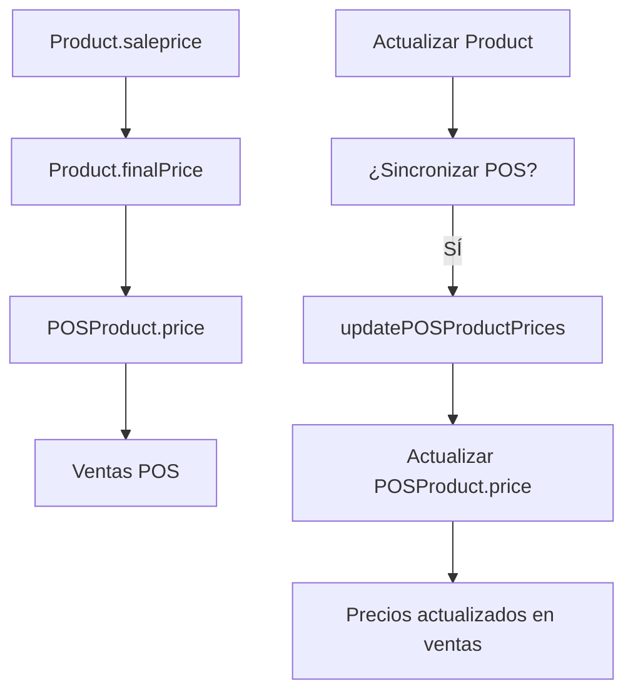

# 🔄 Actualización de Precios Congelados en POS

## 📋 **RESUMEN DEL PROBLEMA**

**Problema identificado:** Los precios se muestran correctamente en los productos pero están montados precios congelados como pasa a la venta después.

### **Síntomas Observados**
- ✅ **Productos en formulario**: Muestran precios correctos (actualizados)
- ❌ **Productos en POS**: Muestran precios antiguos (congelados)
- ❌ **Ventas**: Usan precios congelados del POS, no los actualizados

### **Causa Raíz**
El sistema POS mantiene precios "congelados" en la tabla `POSProduct` que no se actualizan automáticamente cuando se modifican los precios en la tabla `Product`. Esto causa desincronización entre:

1. **Precios en formulario de productos** (actualizados)
2. **Precios en POS** (congelados)
3. **Precios en ventas** (usando precios congelados)

---

## 🔧 **SOLUCIÓN IMPLEMENTADA**

### **1. Función de Actualización**
Se creó la función `updatePOSProductPrices()` que:
- Compara precios actuales en `POSProduct` con precios finales congelados en `Product`
- Actualiza solo los productos que tienen diferencias
- Usa precios finales con IVA incluido (`finalPrice`) o calcula desde `saleprice + IVA`

### **2. Endpoint API**
- **URL**: `/api/pos/update-prices`
- **Método**: POST
- **Función**: Ejecuta la actualización de precios POS

### **3. Componente de Interfaz**
- **Archivo**: `src/components/pos/POSPriceUpdater.tsx`
- **Ubicación**: Página principal del POS (`/dashboard/pos`)
- **Funcionalidad**: Botón para actualizar precios con feedback visual

---

## 📊 **ARQUITECTURA TÉCNICA**

### **Flujo de Datos**


### **Tablas Involucradas**
```sql
-- Tabla Product (origen)
Product {
  id: number
  saleprice: number        -- Precio neto
  finalPrice: number       -- Precio final congelado con IVA
  vat: number              -- Porcentaje IVA
}

-- Tabla POSProduct (destino)
POSProduct {
  id: number
  productId: number        -- FK a Product
  price: number            -- Precio congelado para POS
  name: string
}
```

---

## 🛠️ **IMPLEMENTACIÓN TÉCNICA**

### **Función Principal**
```typescript
export async function updatePOSProductPrices(): Promise<{ success: boolean; data?: any; error?: string }> {
  // 1. Obtener productos POS vinculados
  const posProducts = await supabase
    .from('POSProduct')
    .select(`
      id, name, price as precio_actual_pos, productId,
      product:Product(id, name, saleprice, finalPrice, vat)
    `)
    .not('productId', 'is', null)
  
  // 2. Calcular nuevos precios
  for (const posProduct of posProducts) {
    const product = posProduct.product
    const newPrice = product.finalPrice || 
      Math.round(product.saleprice * (1 + (product.vat || 19) / 100))
    
    // 3. Actualizar si hay diferencia
    if (posProduct.precio_actual_pos !== newPrice) {
      updates.push({ id: posProduct.id, price: newPrice })
    }
  }
  
  // 4. Actualizar en lote
  await supabase.from('POSProduct').upsert(updates)
}
```

### **Lógica de Precios**
```typescript
// Prioridad de precios:
const newPrice = product.finalPrice ||                    // 1. Precio final congelado
                 Math.round(product.saleprice * (1 + (product.vat || 19) / 100))  // 2. Cálculo manual
```

---

## 🎯 **USO DEL SISTEMA**

### **Cuándo Usar**
- Después de actualizar precios de productos
- Cuando hay diferencias entre precios mostrados y precios en ventas
- Antes de iniciar una jornada de ventas
- Cuando se reportan inconsistencias de precios

### **Cómo Usar**
1. Ir a `/dashboard/pos`
2. Buscar la sección "Actualizar Precios POS"
3. Hacer clic en "Actualizar Precios"
4. Esperar confirmación de productos actualizados

### **Resultado Esperado**
```
✅ Precios actualizados
📊 15 productos actualizados

Productos actualizados:
- Café Americano: $1.500 → $1.785
- Sandwich Club: $3.200 → $3.808
- Agua Mineral: $800 → $952
```

---

## 🔍 **DIAGNÓSTICO Y MONITOREO**

### **Verificar Estado Actual**
```sql
-- Productos con diferencias de precios
SELECT 
  pos.id,
  pos.name,
  pos.price as precio_pos,
  p.finalPrice as precio_producto,
  p.saleprice,
  p.vat
FROM POSProduct pos
JOIN Product p ON pos.productId = p.id
WHERE pos.price != COALESCE(p.finalPrice, p.saleprice * (1 + p.vat/100))
```

### **Logs de Actualización**
```typescript
console.log(`📝 Actualizando ${posProduct.name}: $${posProduct.precio_actual_pos} → $${newPrice}`)
console.log(`✅ Actualización completada: ${updates.length} productos actualizados`)
```

---

## ⚠️ **CONSIDERACIONES IMPORTANTES**

### **Limitaciones**
- Solo actualiza productos vinculados (`productId IS NOT NULL`)
- No afecta productos POS independientes
- Requiere permisos de administrador

### **Precauciones**
- **Backup**: Hacer backup antes de actualizaciones masivas
- **Horario**: Ejecutar en horarios de bajo tráfico
- **Verificación**: Confirmar precios después de actualización

### **Casos Especiales**
- **Productos sin IVA**: Se usa IVA 19% por defecto
- **Precios nulos**: Se omiten productos sin precio válido
- **Errores**: Se registran en logs para debugging

---

## 📈 **MÉTRICAS Y MONITOREO**

### **Estadísticas de Actualización**
```typescript
{
  totalProducts: 45,           // Total de productos POS
  updatedProducts: 12,         // Productos actualizados
  skippedProducts: 33,         // Productos sin cambios
  errors: 0                    // Errores durante actualización
}
```

### **Productos Actualizados**
```typescript
[
  {
    id: 123,
    name: "Café Americano",
    oldPrice: 1500,
    newPrice: 1785,
    productId: 456
  }
]
```

---

## 🚀 **FUTURAS MEJORAS**

### **Automatización**
- [ ] Trigger automático al actualizar productos
- [ ] Sincronización programada diaria
- [ ] Notificaciones de desincronización

### **Optimizaciones**
- [ ] Actualización incremental
- [ ] Cache de precios
- [ ] Validación de integridad

### **Funcionalidades**
- [ ] Rollback de actualizaciones
- [ ] Historial de cambios de precios
- [ ] Reportes de desincronización

---

## 📞 **SOPORTE**

### **Problemas Comunes**
1. **"No hay precios para actualizar"**: Todos los precios están sincronizados
2. **"Error de conexión"**: Verificar conectividad con base de datos
3. **"Permisos insuficientes"**: Requiere rol de administrador

### **Contacto**
- **Logs**: Revisar console del navegador
- **Base de datos**: Verificar tablas `POSProduct` y `Product`
- **API**: Endpoint `/api/pos/update-prices`

---

**Documentación actualizada:** Enero 2025  
**Estado:** ✅ **IMPLEMENTADO Y FUNCIONAL**  
**Próxima revisión:** Abril 2025 